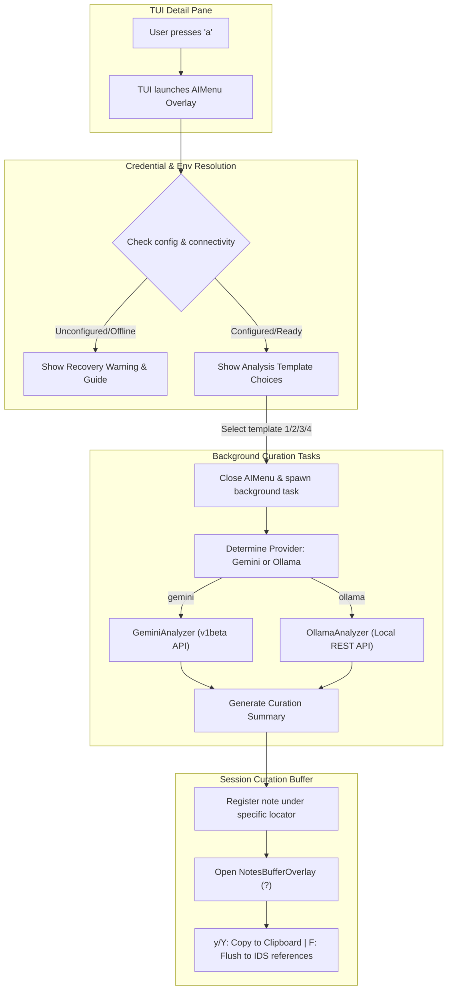

# PatentMine: AI Patent Curation & Analysis Architecture

This document provides a highly detailed specification of the **AI Curation & Analysis** capabilities integrated into PatentMine, detailing the multi-provider runtime, user experience, credential security, logging redaction mechanisms, and automation.

---

## 1. Overview & Architecture

PatentMine leverages a decoupled multi-provider architecture to provide high-performance, intelligent technical curation on patents. The user triggers this capability directly from the TUI Detail View, generating summaries and risk assessments which flow seamlessly into the structured session notes buffer.

### Workflow & Core Architecture


---

## 2. Multi-Provider Setup: Pros & Cons

PatentMine supports both **Google Gemini API (Cloud)** and **Ollama (Local LLM)**. Each has distinct architectural trade-offs:

| Provider | Pros | Cons |
| :--- | :--- | :--- |
| **Google Gemini** <br>`gemini-2.5-flash` | • **Extreme speed**: Outbound HTTP requests complete in 1–3s.<br>• **Deep Context Window**: Accurately digests massive abstracts, citations, and claim paragraphs without memory limits.<br>• **Zero local CPU/GPU load**: Ideal for low-spec developer systems. | • **Internet Dependency**: Inoperable offline or on air-gapped secure networks.<br>• **Data Privacy**: Patent data (bibliographic information, claims) crosses the public cloud gateway.<br>• **Rate limits**: Subject to developer API key usage caps. |
| **Local Ollama** <br>`mistral` | • **Complete Privacy**: 100% offline; patent data never leaves the local loopback (`localhost`).<br>• **Cost Effective**: Unlimited local generations, completely free of charge.<br>• **Total Autonomy**: Run models customized or fine-tuned directly on your secure machine. | • **High Resource Usage**: Heavy load on local CPU/GPU during generation.<br>• **Slower Generation**: Takes 5–15s depending on host GPU capabilities.<br>• **Setup Overhead**: Requires local Ollama installation, service configuration, and pulling the `mistral` model. |

---

## 3. Credential Security & Environment Loading

### Zero-Dependency Key Resolution
To minimize heavy package import overhead, PatentMine implements a custom environment variables resolver inside [config.go](file:///mnt/d/Repos/PatentMineNew/internal/config/config.go).
It automatically searches, parses, and loads configurations from a `.env` file in the following locations, in order of priority:
1. Current working directory `.env`
2. Secure home directory `~/.ssh/patentmine/.env`
3. Home config folder `~/.config/patentmine/.env`

### Key Mappings
Ensure your variables are exported in `.env` as follows:
```ini
# Core Provider Configuration
PATENTMINE_AI_PROVIDER=ollama   # "gemini" or "ollama"

# Google Gemini Credentials
GEMINI_API_KEY=AIzaSyYourSecretAPIKeyHere

# Local Ollama Settings
OLLAMA_MODEL=mistral            # Defaults to mistral
OLLAMA_HOST=http://localhost:11434
```

> [!CAUTION]
> **Sensitive Files Protection**: Always ensure your `~/.ssh/patentmine/.env` file is scoped with secure permissions:
> ```bash
> chmod 700 ~/.ssh/patentmine
> chmod 600 ~/.ssh/patentmine/.env
> ```

---

## 4. Observability & Logging Redaction

A major challenge with AI cloud integrations is that outbound HTTP logs, error reports, and client traces can easily leak active API credentials or passwords. PatentMine implements a complete, automated protection layer to secure these traces.

### The `RedactedRoundTripper`
All outbound requests in the Gemini client go through a secure `RedactedRoundTripper` (implemented inside [observability.go](file:///mnt/d/Repos/PatentMineNew/internal/ai/observability.go)). This custom `http.RoundTripper` intercepts outbound payloads and:
1. **Scrubs Query Parameters**: Scans URLs for sensitive queries (like `?key=AIzaSy...`) and replaces them with `[REDACTED]`.
2. **Filters Custom Headers**: Automatically intercepts header fields (like `x-api-key`, `Authorization`) and redacts their values.
3. **Applies to Request & Response Traces**: Guarantees that any structured `slog` output or diagnostic log never writes active keys to the disk or terminal.

```go
// Example of the RedactedRoundTripper implementation:
type RedactedRoundTripper struct {
	next http.RoundTripper
}

func (r *RedactedRoundTripper) RoundTrip(req *http.Request) (*http.Response, error) {
	// Parse URL queries and redact parameters containing keys/passwords
	q := req.URL.Query()
	if q.Get("key") != "" {
		q.Set("key", "[REDACTED]")
		req.URL.RawQuery = q.Encode()
	}
	
	// Perform standard RoundTrip...
}
```

---

## 5. UI Onboarding Recovery

When a user attempts to run AI curation with an unconfigured or unreachable provider, they are not met with a raw stack trace or a sudden application crash. 

Instead, the `AIMenu` overlay dynamically renders a **Credential Onboarding View** that provides detailed recovery guidance:

1. **Gemini Warning**: Instructs the user to navigate to [Google AI Studio](https://aistudio.google.com/), acquire a free developer API key, and append it as `GEMINI_API_KEY` inside `~/.ssh/patentmine/.env`.
2. **Ollama Offline Warning**: If the loopback daemon is offline or the Mistral model is missing, it displays step-by-step instructions to:
   * Run `cargo make ollama-setup` to download and install Ollama.
   * Start the background daemon.
   * Run `ollama pull mistral`.
3. **Interactive Actions**: The warning view stays fully interactive, allowing the user to seamlessly press `g` or `o` to switch active providers or press `q`/`esc` to close the menu.

---

## 6. Prompt Presets & Customization

The AI engine formats bibliographic data (assignee, inventors, publication dates), the abstract, and the first independent claim, submitting them with targeted prompts based on your TUI selection:

* **Novelty Preset (`1`)**:
  * *Prompt*: `"Summarize the core technical novelty of this patent and highlight key legal/technology design takeaways."`
  * *Notes Locator*: `AI Novelty Summary`
* **Claims Breakdown Preset (`2`)**:
  * *Prompt*: `"Perform a detailed claims and technical breakdown. Explain the scope and boundaries of the independent claims."`
  * *Notes Locator*: `AI Claims Breakdown`
* **Legal & Risk Assessment Preset (`3`)**:
  * *Prompt*: `"Evaluate potential legal & risk factors. Identify prior art exposure, design-around vectors, or potential infringement vulnerabilities."`
  * *Notes Locator*: `AI Legal & Risk takeaways`
* **Custom Instructions (`4`)**:
  * Allows typing any customized prompt.
  * *Notes Locator*: `AI Custom: <first 20 chars of prompt>...`

---

## 7. Troubleshooting

### 1. Ollama Connection Error
* **Symptom**: TUI warning says Ollama is offline/unreachable on `http://localhost:11434`.
* **Fix**: Ensure the background service is running. Run:
  ```bash
  sudo systemctl start ollama
  ```
  If you are running in a WSL2 environment, you may need to start the Windows Ollama application or start it manually inside the shell:
  ```bash
  ollama serve
  ```

### 2. Model Not Found
* **Symptom**: Ollama is running, but the menu reports the model `mistral` is missing.
* **Fix**: Download the model via:
  ```bash
  ollama pull mistral
  ```
  or run the automated task:
  ```bash
  cargo make ollama-setup
  ```

---

## 8. Step-by-Step Usage Guide

Below is a complete, hands-on walkthrough to get started with the AI patent curation tools.

### Phase 1: Environment Configuration
Choose your preferred AI driver (Gemini or Ollama) and configure your environment.

1. **Locate your environment file**: PatentMine resolves variables from `~/.ssh/patentmine/.env` or `./.env`.
2. **Configure Gemini (Cloud Option)**:
   * Navigate to [Google AI Studio](https://aistudio.google.com/) and create a free developer API key.
   * Add the following to your `.env`:
     ```ini
     PATENTMINE_AI_PROVIDER=gemini
     GEMINI_API_KEY=AIzaSyYourSecretAPIKeyHere
     ```
3. **Configure Ollama (Local/Private Option)**:
   * Install and prepare the `mistral` model automatically:
     ```bash
     cargo make ollama-setup
     ```
   * Set your `.env` variables:
     ```ini
     PATENTMINE_AI_PROVIDER=ollama
     OLLAMA_MODEL=mistral
     OLLAMA_HOST=http://localhost:11434
     ```

### Phase 2: Start the System & Load Patent
1. Start the backend daemon and TUI shell with a single task command:
   ```bash
   cargo make run-tui
   ```
2. In the main catalog view, use the arrow keys or `j`/`k` to highlight the patent you want to curate.
3. Open the detail view by pressing **`Enter`** or **`l`**.

### Phase 3: Trigger and Configure the AI analysis
1. Inside the patent details pane, press the **`a`** key. This opens the **AI Patent Curation & Analysis** overlay menu.
2. Observe the current active provider configuration.
   * If you see an **Onboarding Warning**, it means the active provider is either not configured (missing key) or offline (local Ollama port closed).
   * Toggle between providers instantly by pressing **`g`** (switch to Gemini) or **`o`** (switch to Ollama).
3. If the selected provider is ready, trigger one of the following prompts:
   * Press **`1`**: Novelty & Design-Around Takeaways presets.
   * Press **`2`**: Deep claims hierarchy and limitations breakdown.
   * Press **`3`**: Legal/infringement risk and prior-art exposure assessment.
   * Press **`4`**: Custom instruction (type any arbitrary instructions and hit `Enter`).

### Phase 4: Read, Copy, and Export Curation Reports
1. When you select a template, the popup menu closes instantly. The analysis is dispatched to a background thread to keep your terminal perfectly responsive.
2. Monitor the bottom-right status line. You will see a spinner/status notifying you that the AI analysis is active.
3. As soon as the generation completes, the TUI automatically opens the **Notes Buffer Overlay**, displaying your freshly generated curation summary under its descriptive heading.
4. Manage and export the summary:
   * **Scroll** the note content with arrow keys or `Page Up`/`Page Down`.
   * Press **`y`** to copy the selected note block to your system clipboard.
   * Press **`Y`** to copy all session notes/summaries to the clipboard.
   * Press **`F`** to flush the note directly to your active project's Information Disclosure Statement (IDS) references list.
   * Press **`q`** or **`esc`** to close the notes overlay and resume reviewing the patent metadata.
