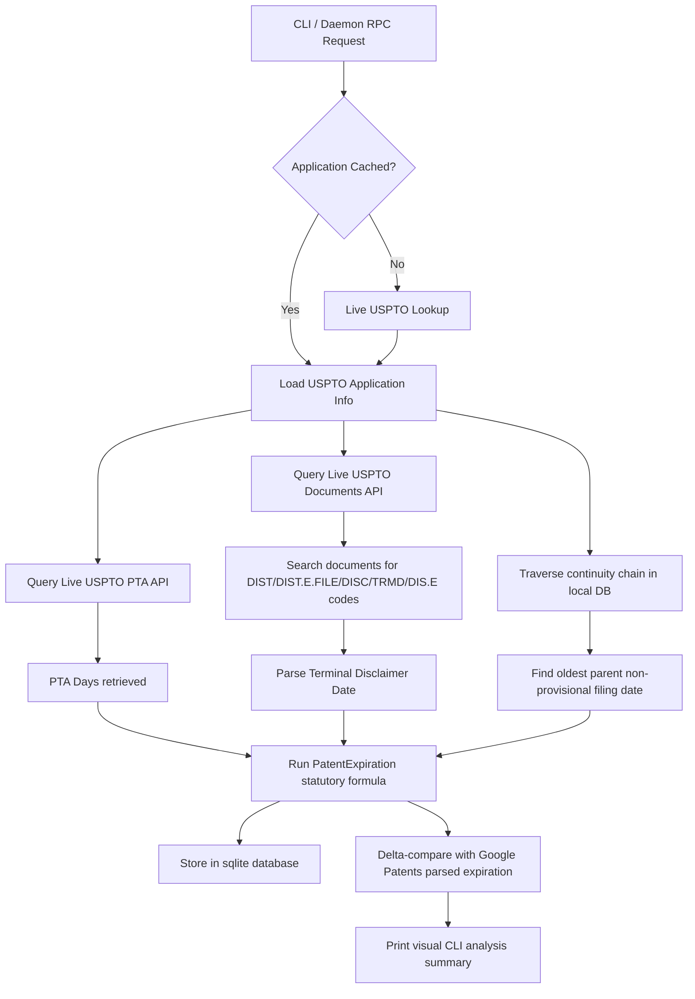

# U.S. Patent Expiration Date Computation

This document explains the statutory calculation rules, database integration, live API fetches, and CLI tools for computing estimated U.S. patent expiration dates.

---

## 1. The Statutory Expiration Formula

Determining a patent's expiration is not as simple as adding 20 years to its filing date. Under U.S. law (35 U.S.C. § 154 and 35 U.S.C. § 156), the statutory expiration date is computed using a combination of the patent type, continuity history, patent term adjustments, and terminal disclaimers.

The integrated formula in `patentmine` is:

$$\text{Expiration} = \text{Base Date} + 20\text{ years} + \text{PTA} + \text{PTE} - \text{Terminal Disclaimer (if applicable)}$$

### A. Patent Types & Base Dates
- **Utility & Plant Patents**:
  - The term is **20 years** from the **Earliest Term Filing Date**.
  - If the patent does not claim continuity/priority to an earlier application, the base date is simply its own **Filing Date**.
- **Design Patents**:
  - The term is **15 years** from the **Grant Date** (for applications filed on or after May 13, 2015). Design patents are not subject to PTA or earliest term filing date calculations.

### B. Earliest Term Filing Date (35 U.S.C. § 154(a)(2))
Under 35 U.S.C. § 154, the 20-year term begins on the filing date of the *earliest* application in the U.S. to which the patent claims continuity (such as Continuation, Continuation-in-Part, or Divisional applications).
- **Provisional Applications (35 U.S.C. § 154(a)(3))**: Provisional filings (serial code prefixes `60`, `61`, or `62`, or code `PROV`) strictly *do not* start the 20-year clock. They are bypassed during earliest term filing date resolution.

### C. Patent Term Adjustment (PTA) & Extension (PTE)
- **Patent Term Adjustment (35 U.S.C. § 154(b))**: Added to the term as compensation for delays caused by the USPTO during prosecution.
- **Patent Term Extension (35 U.S.C. § 156)**: Added to the term as compensation for delays due to regulatory review processes (e.g., FDA approval).

### D. Terminal Disclaimers
A **Terminal Disclaimer** is a legal filing where a patent owner disclaims a portion of a patent's term, typically to match the expiration date of an earlier-filed, commonly owned patent (to avoid double patenting). If a terminal disclaimer is present, the patent's term is capped and cannot extend past that disclaimer date.

---

## 2. Dynamic Integration Architecture

`patentmine` implements a hybrid, asynchronous lookup and traversal process to compute these values automatically:



1. **PTA Fetching**: Calls `https://api.uspto.gov/api/v1/patent/applications/{appNum}/patent-term-adjustment` strictly using uppercase header authentication (`X-API-KEY`) to retrieve the exact adjustment days.
2. **Terminal Disclaimer Detection**: Queries `https://api.uspto.gov/api/v1/patent/applications/{appNum}/documents` to inspect the patent prosecution history. It identifies terminal disclaimer events using a package-level dictionary of codes (`DIST`, `DIST.E.FILE`, `DISC`, `TRMD`, or `DIS.E`) or text descriptions. It extracts the date using a robust fallback search order across the following keys: `MailDate`, `OfficialDate`, `MailRoomDate`, `FilingDate`, and `DocumentDate`.
3. **Continuity Traversal**: Recursively climbs the `uspto_continuity` table to build a full ancestor parent tree, resolving the absolute earliest filing date while correctly ignoring provisional applications using a backtracking cycle detection algorithm.
4. **Google Patents Comparison**: Resolves the parsed expiration date from Google Patents and compares the statutory USPTO date with the Google date, outputting the delta.

---

## 3. CLI Command & Usage

### Running via Task Runner (`makers`)
You can compute the expiration date of any patent or application in the database directly:

```bash
# Standard lookup (compares USPTO and Google Patents side-by-side)
$ makers expiration-date US14558776

# Force refresh application metadata from USPTO live API, recompute, and save to SQLite
$ makers expiration-date -refresh US14558776

# Query USPTO source and associate the patent with a specific project ID for review
$ makers expiration-date -project p-1779920831541270511 US14558776

# Query USPTO source only
$ makers expiration-date -source uspto US14558776

# Query Google Patents parsed source only
$ makers expiration-date -source google US14558776
```

### CLI Command Help
```bash
$ go run ./cmd/patentmine expiration-date -help
usage:
  patentmine expiration-date [options] <application-or-patent-number>

options:
  -source string   data source: uspto, google, or both (default "both")
  -refresh         force refresh application metadata from USPTO
```

### Database Integration & Continuity Warn
When computing the expiration date for utility or plant patents, a recursive traversal of domestic priority (parent applications) is conducted to identify the correct earliest term filing date. When running in the CLI, the tool will automatically output a status message indicating local database access:
```
Warning: Walking the continuity chain recursively requires local database access. Conducting a database search...
Persisted computed expiration to database.
```

The output includes a precise `Computed On` field indicating the exact timestamp (local time) when the calculation was conducted. This computation date is persisted to the database and is rendered inside the TUI overlay as well.

---

## 4. Stored Data Schema

The expiration-date computation stores its results in the `uspto_application` table in the local SQLite database (`patentmine.db`). The data is persisted via `store.NodeBatch` → `repo.SaveNode()` which calls the upsert in `internal/store/sqlite/source_data.go:62-124`.

### `uspto_application` — Expiration-Related Columns

| Column | Type | Source | Description |
|--------|------|--------|-------------|
| `application_number` | TEXT PK | USPTO ODP search API | Resolved application number |
| `record_id` | TEXT | patent table FK | Links to `patent.record_id` |
| `filing_date` | TEXT | USPTO ODP search API | Filing date of the application (YYYY-MM-DD) |
| `application_type_label` | TEXT | USPTO ODP search API | e.g. "Utility Patent", "Design Patent" |
| `application_type_category` | TEXT | USPTO ODP search API | e.g. "UTILITY", "DESIGN" |
| `patent_term_adjustment_days` | INTEGER | USPTO PTA API (live) | Patent Term Adjustment days (35 U.S.C. § 154(b)) |
| `patent_term_extension_days` | INTEGER | USPTO/other | Patent Term Extension days (35 U.S.C. § 156) |
| `terminal_disclaimer_date` | TEXT | USPTO Documents API (live) | Earliest terminal disclaimer date (YYYY-MM-DD) |
| `earliest_term_filing_date` | TEXT | Computed via continuity chain walk | Oldest non-provisional parent filing date (YYYY-MM-DD) |
| `computed_expiration_date` | TEXT | Computed via `PatentExpiration` formula | Final computed expiration date (YYYY-MM-DD) |
| `last_ingestion_datetime` | TEXT | Current timestamp | When the record was last updated |
| `fetched_at` | TEXT | Current timestamp | When data was fetched from USPTO |

### `uspto_continuity` — Parent-Child Relationship Chain

| Column | Type | Description |
|--------|------|-------------|
| `application_number` | TEXT | Child application number |
| `parent_application_number_text` | TEXT | Parent application number |
| `child_application_number_text` | TEXT | Child application number text |
| `parent_application_filing_date` | TEXT | Parent's filing date |
| `claim_parentage_type_code` | TEXT | Relationship type code (e.g. "CON", "DIV", "CIP") |
| `claim_parentage_type_description_text` | TEXT | Relationship description |
| `parent_record_id` | TEXT | FK to `patent.record_id` for parent |
| `child_record_id` | TEXT | FK to `patent.record_id` for child |

Populated by the USPTO crawl/enrichment pipeline (`internal/crawl/uspto.go`). Queried by `ComputeEarliestTermFilingDate` to walk the non-provisional parent chain.

### Expiration Flow — What Gets Stored on Each Run

```
Run without -refresh:
  ┌─ DB cache hit? → Use cached application_number, filing_date, type
  └─ DB cache miss? → Fetch live from USPTO ODP search API
                      ↓
  Fetch PTA (live) ──────────┐
  Fetch TD date (live) ──────┤
  Walk continuity chain (DB) ─┤
  Compute PatentExpiration ───┘
                      ↓
  Save to uspto_application:
    patent_term_adjustment_days, terminal_disclaimer_date,
    earliest_term_filing_date, computed_expiration_date

Run with -refresh:
  Skip DB cache → always fetch application_number, filing_date, etc. from USPTO live API
  Then same PTA/TD/computation/save flow as above
```
