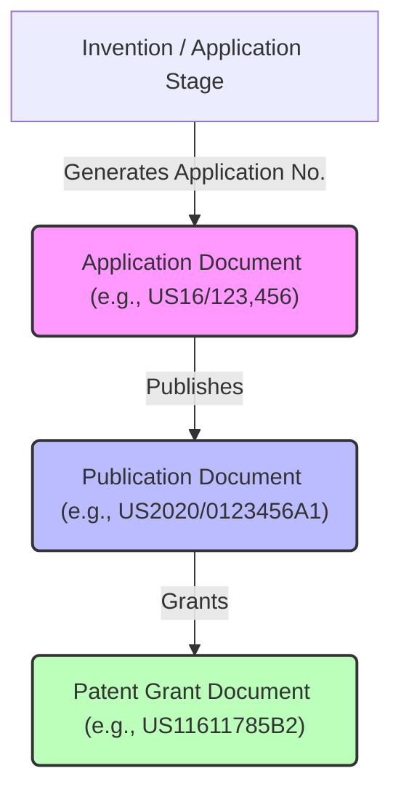
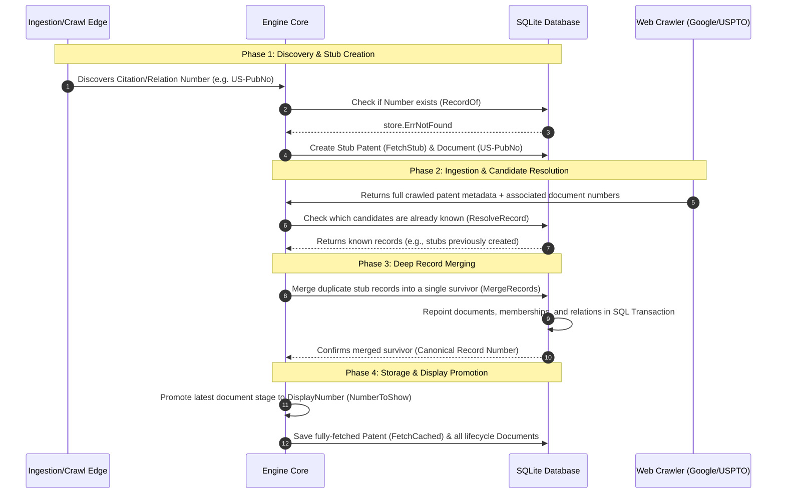

# PatentMine: Architectural & Lifecycle Manual

PatentMine is a high-performance patent curation and ingestion engine. At its core, the project solves a fundamental data modeling challenge: **patent number indirection and record merging across lifecycle stages**, while providing real-time family-tree crawl orchestration and a responsive terminal user interface (TUI).

This manual details the architecture, dynamic value-type systems, lifecycle phases of a patent, database cascades, deletion models, and codebase navigation.

---

## 1. The Core Challenge: The Multi-Stage Patent Identifier

A single patented invention does not have a single, static identifier. It progresses through multiple distinct lifecycle stages, each producing different numbers and document types under the same patent "family":



During ingestion, citation crawls, or user project curation:
* Ingestion sources (Google Patents, Justia, USPTO, WIPO) record relationships using whatever stage numbers they crawled first.
* A citation in an older patent might point directly to an *application* number.
* A newer patent's family citation edge might point to the *grant* number of that same invention.

Without indirection, this would lead to **duplicate records** representing different stages of the same patent, and **severed relationship graphs** where edges fail to connect.

---

## 2. The Data Model & Value-Type System

PatentMine solves this mapping problem by separating **Canonical Identity**, **Display Identity**, and **Individual Documents**:

```
 ┌──────────────────────────────────────────────────────────────────────────┐
 │                                 PATENT                                   │
 │  • Number (Canonical Key - e.g. US16000001)                              │
 │  • DisplayNumber (Latest Promoted Stage - e.g. US11000001B2)             │
 └────────────────────────────────────┬─────────────────────────────────────┘
                                      │
                                      ▼
                        ┌─────────────┴─────────────┐
                        │      LIFECYCLE DOCUMENTS  │
                        ├───────────────────────────┤
                        │ • US16000001 (Application)│
                        │ • US20180001 (Publication)│
                        │ • US11000001 (Grant)      │
                        └───────────────────────────┘
```

### Key Value Types (`internal/domain`)
1. **`PatentNumber`** (`number.go`): A parsed, normalized value type containing:
   * `Country` (ISO-2, e.g., `US`)
   * `Serial` (Only raw digits, e.g., `11611785`)
   * `Kind` (Optional stage code, e.g., `B2`)
   
   It implements custom JSON marshaling so it transfers across the wire and sqlite DB as a canonical string (`US11611785B2`) but compares equal when every field matches.
2. **`Document`** (`document.go`): Represents a single life-stage document (application, publication, or grant) containing its specific stage, date, and `PatentNumber`.
3. **`Patent`** (`patent.go`): The master entity. It carries:
   * **`Number`**: The permanent canonical record key (representing the first document number ever discovered for this record).
   * **`DisplayNumber`**: The latest-stage number (grant over publication over application) dynamically promoted for presentation.
   * **`Documents`**: The array of all child documents discovered for this patent.

---

## 3. The Patent Lifecycle

A patent record travels through four distinct phases in its lifetime:



### Phase 1: Discovery & Stub Creation
* When a user adds a raw patent number to a project, or when a family crawl discovers a citation edge (`saveRelations` in `crawl.go`), the engine calls `ensureRecord`.
* The engine queries the `document` table via `RecordOf` to resolve the number. 
* If the number is unknown, a **Stub Patent** is immediately saved with `FetchState = FetchStub`. A corresponding `Document` is inserted pointing to this stub. This creates a placeholder in the family graph before fetching its metadata.

### Phase 2: Ingestion & Candidate Resolution
* When the web crawler retrieves the full patent, it returns a package of metadata plus all associated lifecycle documents (the "candidates").
* In `resolveRecord` (`crawl.go`), the crawler queries `RecordOf` for each candidate to see which existing stubs are already in the system.

### Phase 3: Deep Record Merging
* If candidates are mapped to different existing stub records (e.g. one stub was created for the application number from an old citation, and another for the grant number from a project membership), the crawler merges them to eliminate duplicates.
* `MergeRecords` runs a complete, ACID-compliant SQLite transaction that:
  1. Repoints all documents from the absorbed record to the survivor canonical record.
  2. Moves all project memberships, skipping duplicates (`UPDATE OR IGNORE`).
  3. Updates all incoming/outgoing relation edges, preventing self-references.
  4. Deletes the obsolete absorbed patent row from the database.

### Phase 4: Display Promotion
* Once merged and stored, the patent's `DisplayNumber` is dynamically promoted. 
* The engine scans all attached documents and selects the highest-stage document (Grant > Publication > Application), falling back to the canonical `Number` if no documents exist.
* The visual TUI prints the `DisplayNumber` (e.g. `US11611785B2`) in lists, but all background graph walks, edits, and tagging walk the canonical `Number` (`US16123456`).

---

## 4. Deletion & Purging Mechanics

PatentMine manages data deletion and graph integrity through cascade configurations and activity logs:

### A. Automated SQLite Cascades
The database schema (`schema.sql`) enforces hard referential integrity. Deleting a patent row automatically purges all child metadata via `ON DELETE CASCADE` constraints:

```sql
CREATE TABLE IF NOT EXISTS document (
    number        TEXT PRIMARY KEY,
    record_number TEXT NOT NULL REFERENCES patent (number) ON DELETE CASCADE,
    ...
);

CREATE TABLE IF NOT EXISTS patent_tag (
    tag_id        INTEGER NOT NULL REFERENCES tag (id) ON DELETE CASCADE,
    patent_number TEXT NOT NULL REFERENCES patent (number) ON DELETE CASCADE,
    ...
);

CREATE TABLE IF NOT EXISTS project_ids (
    patent_number TEXT NOT NULL REFERENCES patent (number) ON DELETE CASCADE,
    ...
);
```

> [!NOTE]
> While tag *assignments* (`patent_tag`) are deleted, tag *definitions* (`tag` table) are preserved. Scoped to the project, they remain available for other patents.

### B. Graph Topology Handling
Because relations (`relation` table) can point to placeholders that aren't yet fully ingested, they do not use strict foreign key constraints. Two models exist for deleting family edges:

1. **Hard Purge (Current Model)**: Deletes all incoming and outgoing relation edges involving the patent:
   ```sql
   DELETE FROM relation WHERE from_number = ? OR to_number = ?;
   ```
   This severs the relationship graph completely at this node, dividing a path ($A \to B \to C$) into isolated clusters ($A$ and $C$).
2. **Soft Purge (Alternative / Graph Healing)**: Keep the topological structure of the graph intact by:
   * **Parent-Child Promotion**: Drawing direct shortcuts between all of a deleted node's parents and children ($A \to C$) before deletion.
   * **Convert to FetchStub**: Keeping the node in the `patent` table but stripping all metadata and memberships, retaining only a lightweight stub to preserve the graph.

### C. Backup & Replay Architecture
To guarantee auditability and data recovery during hard purges, PatentMine leverages its semantic activity journal (`observability.Record` in `observability.go`):

```
       ┌────────────────────────────────────────────────────────┐
       │                 DELETE INITIATED                       │
       └───────────────────────────┬────────────────────────────┘
                                   │
                                   ▼
                   ┌───────────────────────────────┐
                   │    COMPILE FULL SNAPSHOT      │
                   │   Patent, Docs, and Relations │
                   └───────────────┬───────────────┘
                                   │
                                   ▼
                   ┌───────────────────────────────┐
                   │     WRITE TO ACTIVITY LOG     │
                   │  "patent.delete" -> Before    │
                   └───────────────┬───────────────┘
                                   │
                                   ▼
                   ┌───────────────────────────────┐
                   │     EXECUTE SQL TRANSACTION   │
                   │  Delete Row, Cascades Trigger │
                   └───────────────┬───────────────┘
                                   │
                   ┌───────────────┴───────────────┐
                   ▼                               ▼
      [ REPLAY MODE A: FULL RESTORE ]  [ REPLAY MODE B: SOFT REPLAY ]
       Restore all metadata, documents  Restore ONLY relations & stub,
       and relations exactly as before. keeping the graph intact.
```

1. **Hard Purge Backup**: Prior to executing the database delete transaction, the engine compiles a full snapshot of the patent, its child documents, and all connected relation edges. This snapshot is saved to the activity journal's `Before` payload under the `"patent.delete"` action.
2. **Replay Capabilities**: The persisted activity log can be replayed to recover the deleted node:
   * **Full Replay**: Completely restores all metadata, documents, and relation edges.
   * **Soft Replay**: Re-creates the record strictly as a `FetchStub` and restores only its relation edges. This heals the graph topology without loading heavy abstract or claim text.

---

## 5. Codebase Navigation Guide

For engineers maintaining or extending the indirection and lifecycle systems, key components are mapped below:

| Feature Component | File Location | Key Function / Lines | Purpose |
| :--- | :--- | :--- | :--- |
| **Parsing & Value Type** | [`internal/domain/number.go`](file:///mnt/d/Repos/PatentMineNew/internal/domain/number.go) | `ParsePatentNumber` / `Normalized` | Uppercases, strips symbols, and formats consistent patent strings. |
| **Database Contract** | [`internal/store/repository.go`](file:///mnt/d/Repos/PatentMineNew/internal/store/repository.go) | `MergeRecords` | Defines the database interface for repointing records. |
| **DB Indirection Lookup** | [`internal/store/sqlite/document.go`](file:///mnt/d/Repos/PatentMineNew/internal/store/sqlite/document.go) | `RecordOf` | Queries the `document` table to find the canonical parent number. |
| **ACID Merging** | [`internal/store/sqlite/document.go`](file:///mnt/d/Repos/PatentMineNew/internal/store/sqlite/document.go) | `MergeRecords` | SQL transaction that repoints documents, memberships, relations, and deletes duplicate rows. |
| **Candidate Resolution** | [`internal/ingest/crawl.go`](file:///mnt/d/Repos/PatentMineNew/internal/ingest/crawl.go) | `resolveRecord` | Checks candidate document numbers and triggers `MergeRecords` on conflicts. |
| **Stub Ingestion** | [`internal/engine/engine.go`](file:///mnt/d/Repos/PatentMineNew/internal/engine/engine.go) | `ensureRecord` | Creates a new stub patent and document when a candidate is first discovered. |
| **Deletion Mechanics** | [`internal/store/sqlite/patent.go`](file:///mnt/d/Repos/PatentMineNew/internal/store/sqlite/patent.go) | `DeletePatent` | Hand-purges incoming/outgoing relations, and deletes the main patent row (cascading to other tables). |
| **Activity Journal** | [`internal/observability/observability.go`](file:///mnt/d/Repos/PatentMineNew/internal/observability/observability.go) | `Record` | Declares the JSONL record structure used for backup and replay. |

---

## 6. CLI Subcommands & TUI Shortcut Reference

For complete operational visibility, the command-line interface subcommands and the Terminal User Interface (TUI) keyboard shortcuts are cataloged below.

### CLI Subcommands
Launch CLI operations using the `patentmine` binary:
* `patentmine serve` : Start the high-performance engine daemon (binds database and orchestrates Unix sockets).
* `patentmine stop` : Send a termination signal to stop the running daemon.
* `patentmine tui` : Launch the interactive Terminal User Interface thin client.
* `patentmine api` : Boot the web API server gateway.
* `patentmine paths` : Output the resolved runtime directories and file paths.
* `patentmine version` : Print the current system build version.

### TUI Keyboard Shortcuts

The TUI automatically builds its scrollable help overlay (`?`) dynamically from source bindings, ensuring it never drifts. Below is the master keymap reference:

#### A. Global Key Bindings (Active Everywhere)
* `ctrl+c` / `Q` : Quit the TUI application completely.
* `?` : Open the interactive Help overlay.
* `q` / `h` / `left` : Go back to the previous screen or close the focused overlay panel.
* `:` : Open the CLI direct command prompt palette.

#### B. Common Scrolling & Motions
* `j` / `down` : Move selection pointer down by one row.
* `k` / `up` : Move selection pointer up by one row.
* `ctrl+d` / `pgdown` : Page selection down.
* `ctrl+u` / `pgup` : Page selection up.
* `g g` : Jump straight to the top of the list.
* `G` : Jump straight to the bottom of the list.

#### C. Common Patent Workflow Actions
*(Available in Catalog, Detail, and Citations views when a patent is selected)*
* `s` : Move patent workflow review state to **Stored**.
* `r` : Move patent workflow review state to **Under Review**.
* `i` : Move patent workflow review state to **Ignored**.
* `x` : Move patent workflow review state to **Deleted**.
* `D` : Trigger **Hard Purge** (permanently delete the patent, compile snapshot, and write backup to activity log).
* `a` : Link the selected patent to a specific project membership.
* `f` : Trigger a recursive **Family Crawl** to ingest parents, children, and relations.
* `F` : Fetch current patent details (single-patent metadata ingestion).

#### D. Catalog Pane Bindings
* `enter` / `l` : Open the patent detail pane for the selected record.
* `I` : Open the project's Information Disclosure Statement (IDS) editor.
* `w` : Open the current patent's source web page in your default browser.
* `right` / `left` : Navigate columns horizontally.
* `.` : Toggle and apply sorting on the currently focused column.
* `c` : Open the family citations graph panel.
* `b` : Open the "cited by" family citations graph panel.
* `p` : Toggle the Projects dashboard list.
* `/` : Open the Find/Filter query prompt.
* `n` / `N` : Navigate forwards/backwards through Find/Filter pattern matches.
* `ctrl+r` : Hard refresh the catalog database view.
* `v` : Enter line-based visual selection mode.
* `esc` : Cancel visual selection.

#### E. Detail View Bindings
* `I` : Transition directly to the IDS editor.
* `c` / `b` : View family citations or "cited by" records.
* `p` : Navigate to the Projects list.
* `/` : Open query prompt to search/highlight text inside details.
* `;` : Open jump mode to instantly scroll to headings, claims, or section anchors.
* `ctrl+r` : Refresh the current detail views.

#### F. IDS Curation Pane Bindings
* `enter` / `e` : Edit reference fields inside the curated IDS entries.
* `f` : Toggle full listing/narrow views.
* `s` : Cycle IDS review statuses (Pending, Approved, Disclosed).
* `D` : Delete the selected reference from the IDS form.
* `p` : Switch back to the Projects dashboard.
* `ctrl+r` : Refresh references.

#### G. Projects Dashboard Bindings
* `enter` / `l` / `right` : Activate and open the selected project.
* `u` : Deactivate the current active project filter.
* `n` : Create a new project profile.
* `I` : Export the complete Information Disclosure Statement (IDS) draft.
* `/` : Search project listings.
* `ctrl+r` : Refresh project items.
