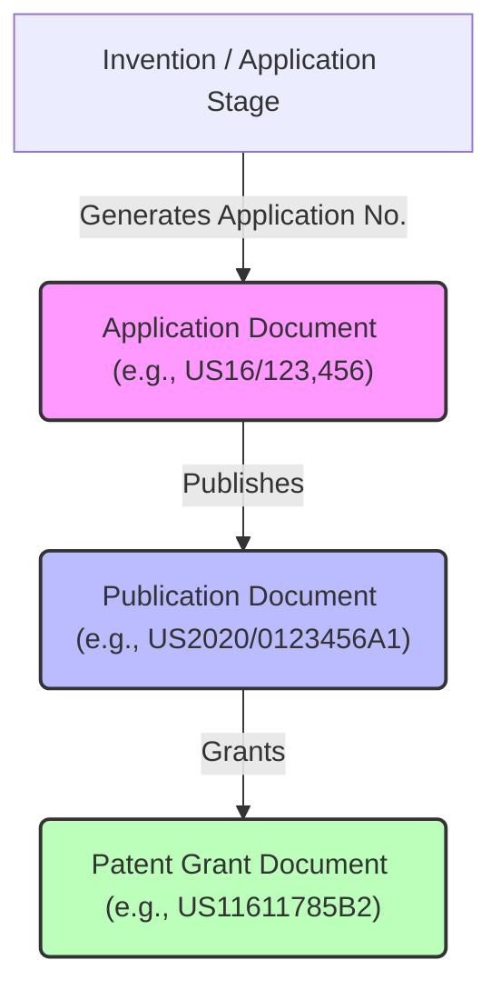

# PatentMine: Architectural & Lifecycle Manual

PatentMine is a high-performance patent curation and crawling engine. At its core, the project solves a fundamental data modeling challenge: **patent number indirection and record merging across lifecycle stages**, while providing real-time family-tree crawl orchestration and a responsive terminal user interface (TUI).

This manual details the architecture, dynamic value-type systems, lifecycle phases of a patent, database cascades, deletion models, and codebase navigation.

Related docs:

1. [Metrics Guide](./metrics.md)
2. [Telemetry & Activity Tracking Guide](./ACTIVITY.md)
3. [USPTO Loading & Source Configuration](./USPTO_CONFIG_LOADING.md)
4. [TUI :add Execution Flow](./TUI_ADD_FLOW.md)
5. [U.S. Patent Expiration Date Computation](./EXPIRATION_DATE.md)
6. [Web REST API Reference](./REST_API.md)
7. [Assignee & Ownership History (usage)](./TUI_ASSIGNEE_FLOW.md)
8. [Daemon-Side Assignee Flow](./DAEMON_ASSIGNEE_FLOW.md)

---

## 1. The Core Challenge: The Multi-Stage Patent Identifier

A single patented invention does not have a single, static identifier. It progresses through multiple distinct lifecycle stages, each producing different numbers and document types under the same patent "family":



During crawling, citation crawls, or user project curation:
* Crawl sources (Google Patents, Justia, USPTO, WIPO) record relationships using whatever stage numbers they crawled first.
* A citation in an older patent might point directly to an *application* number.
* A newer patent's family citation edge might point to the *grant* number of that same invention.

Without indirection, this would lead to **duplicate records** representing different stages of the same patent, and **severed relationship graphs** where edges fail to connect.

---

## 2. The Data Model & Value-Type System

PatentMine solves this mapping problem by separating **Canonical Identity**, **Display Identity**, and **Individual Documents**:

```
 ┌──────────────────────────────────────────────────────────────────────────┐
 │                                 PATENT                                   │
 │  • Number (Canonical Key - e.g. US16000001)                              │
 │  • DisplayNumber (Latest Promoted Stage - e.g. US11000001B2)             │
 └────────────────────────────────────┬─────────────────────────────────────┘
                                      │
                                      ▼
                        ┌─────────────┴─────────────┐
                        │      LIFECYCLE DOCUMENTS  │
                        ├───────────────────────────┤
                        │ • US16000001 (Application)│
                        │ • US20180001 (Publication)│
                        │ • US11000001 (Grant)      │
                        └───────────────────────────┘
```

### Key Value Types (`internal/domain`)
1. **`PatentNumber`** (`number.go`): A parsed, normalized value type containing:
   * `Country` (ISO-2, e.g., `US`; empty when the source omits it)
   * `Serial` (Only raw digits, e.g., `11611785` — separators like `/`, `,`, `-`, and spaces are stripped on parse)
   * `Kind` (Optional stage/kind code, e.g., `B2`; empty for application numbers)

   It implements custom JSON marshaling so it transfers across the wire and sqlite DB as a canonical string (`US11611785B2`) but compares equal when every field matches.

   **`PatentNumber` is stage-agnostic.** It is *not* a "granted patent number" — it is whatever identifier a source happened to record, which may name any of the three lifecycle documents. The `Kind` code is what distinguishes them:

   | Lifecycle document | Example inputs (all parse equal) | Canonical form | `Kind` |
   | --- | --- | --- | --- |
   | **Application** | `16/123,456`, `US16123456`, `US 16/123,456` | `US16123456` | *(none)* |
   | **Publication** (pre-grant) | `US2020/0123456A1`, `US20200123456A1` | `US20200123456A1` | `A1` |
   | **Grant** | `US11,611,785 B2`, `US11611785B2`, `11611785` | `US11611785B2` | `B2` |

   Because the same invention owns all three numbers, a `PatentNumber` on its own does not tell you which patent record it belongs to — that mapping is resolved at `:add`/crawl time (see [§8.6](#86-what-add-number-accepts-and-how-each-source-mode-resolves-it)). The record's *granted* number, specifically, is exposed by `Patent.GrantedNumber()` — the `Kind: B2` grant document, used e.g. to build the canonical Google Patents link — which is distinct from the stage-agnostic `Number` (canonical record key, usually the application) and `DisplayNumber` (latest promoted stage).
2. **`Document`** (`document.go`): Represents a single life-stage document (application, publication, or grant) containing its specific stage, date, and `PatentNumber`.
3. **`Patent`** (`patent.go`): The master entity. It carries:
   * **`Number`**: The permanent canonical record key (representing the first document number ever discovered for this record).
   * **`DisplayNumber`**: The latest-stage number (grant over publication over application) dynamically promoted for presentation.
   * **`Documents`**: The array of all child documents discovered for this patent.

---

## 3. The Patent Lifecycle

A patent record travels through four distinct phases in its lifetime:


### Phase 1: Discovery & Stub Creation
* When a user adds a raw patent number to a project, or when a family crawl discovers a citation edge (`saveRelations` in `crawl.go`), the engine initiates resolution.
* **Proactive Local Check**: The engine first queries the `document` table via `RecordOf` to check if the requested document number is already known to belong to an existing parent record. If found, it reuses the record number directly, avoiding duplicate stub creation.
* **ODP Candidate Pre-Resolution**: If the number is unknown locally and the mode is USPTO-preferred, the engine performs a candidate lookup on USPTO ODP. If it matches a single application wrapper, the engine maps the requested publication or grant number to its canonical Application ID. If multiple wrappers match, a picker is shown in the TUI.
* **Stub Placeholder**: If the number remains unknown after checks, a **Stub Patent** is saved under the resolved canonical number (with `FetchState = FetchStub`), and a corresponding `Document` is inserted pointing to this stub. This creates a placeholder in the family graph before fetching its metadata.

### Phase 2: Crawl & Candidate Resolution
* When the web crawler retrieves the full patent, it returns a package of metadata plus all associated lifecycle documents (the "candidates").
* In `resolveRecord` (`crawl.go`), the crawler queries `RecordOf` for each candidate to see which existing stubs are already in the system.

### Phase 3: Deep Record Merging & Self-Healing
* If stubs for different stages (such as the publication and the grant) were added concurrently before any crawl completed, they co-exist in the database. 
* As soon as either fetch completes and is ingested, `resolveRecord` detects both stubs among the fetched candidates and automatically triggers a deep merge.
* `MergeRecords` runs a complete, ACID-compliant SQLite transaction that:
  1. Repoints all documents from the absorbed record to the survivor canonical record.
  2. Moves all project memberships, skipping duplicates (`UPDATE OR IGNORE`).
  3. Updates all incoming/outgoing relation edges, preventing self-references.
  4. Deletes the obsolete absorbed patent row from the database.

### Phase 4: Display Promotion
* Once merged and stored, the patent's `DisplayNumber` is dynamically promoted. 
* The engine scans all attached documents and selects the highest-stage document (Grant > Publication > Application), falling back to the canonical `Number` if no documents exist.
* The visual TUI prints the `DisplayNumber` (e.g. `US11611785B2`) in lists, but all background graph walks, edits, and tagging walk the canonical `Number` (`US16123456`).


---

## 4. Deletion & Purging Mechanics

PatentMine manages data deletion and graph integrity through cascade configurations and activity logs:

### A. Automated SQLite Cascades
The database schema (`schema.sql`) enforces hard referential integrity. Deleting a patent row automatically purges all child metadata via `ON DELETE CASCADE` constraints:

```sql
CREATE TABLE IF NOT EXISTS document (
    number        TEXT PRIMARY KEY,
    record_number TEXT NOT NULL REFERENCES patent (number) ON DELETE CASCADE,
    ...
);

CREATE TABLE IF NOT EXISTS patent_tag (
    tag_id        INTEGER NOT NULL REFERENCES tag (id) ON DELETE CASCADE,
    patent_number TEXT NOT NULL REFERENCES patent (number) ON DELETE CASCADE,
    ...
);

CREATE TABLE IF NOT EXISTS project_ids (
    patent_number TEXT NOT NULL REFERENCES patent (number) ON DELETE CASCADE,
    ...
);
```

> [!NOTE]
> While tag *assignments* (`patent_tag`) are deleted, tag *definitions* (`tag` table) are preserved. Scoped to the project, they remain available for other patents.

> [!IMPORTANT]
> **Strict Tag Taxonomy Constraints**:
> 1. **Fixed Taxonomy List**: Tags must be explicitly added to a project's taxonomy table first using `:tag.add <name>` (or via the REST API) before they can be assigned to a patent. Assigning an unregistered tag will fail.
> 2. **Naming Validation**: All tag names are strictly restricted to lowercase snake_case matching the regex pattern `^[a-z0-9_]+$`. Any creation or registration of tags violating this rule is rejected.
> 3. **Auditable Timestamps**: The `patent_tag` assignment tracks the exact timestamp (`assigned_at`) when the tag was linked to a patent.
> 4. **Cascading Deletions**: Deleting a tag from the taxonomy automatically deletes all corresponding patent-tag assignments in that project via SQLite cascading foreign keys.

### B. Graph Topology Handling
Because relations (`relation` table) can point to placeholders that aren't yet fully crawled, they do not use strict foreign key constraints. Two models exist for deleting family edges:

1. **Hard Purge (Current Model)**: Deletes all incoming and outgoing relation edges involving the patent:
   ```sql
   DELETE FROM relation WHERE from_number = ? OR to_number = ?;
   ```
   This severs the relationship graph completely at this node, dividing a path ($A \to B \to C$) into isolated clusters ($A$ and $C$).
2. **Soft Purge (Alternative / Graph Healing)**: Keep the topological structure of the graph intact by:
   * **Parent-Child Promotion**: Drawing direct shortcuts between all of a deleted node's parents and children ($A \to C$) before deletion.
   * **Convert to FetchStub**: Keeping the node in the `patent` table but stripping all metadata and memberships, retaining only a lightweight stub to preserve the graph.

### C. Backup & Replay Architecture
To guarantee auditability and data recovery during hard purges, PatentMine leverages its semantic activity journal (`observability.Record` in `observability.go`):

```
       ┌────────────────────────────────────────────────────────┐
       │                 DELETE INITIATED                       │
       └───────────────────────────┬────────────────────────────┘
                                   │
                                   ▼
                   ┌───────────────────────────────┐
                   │    COMPILE FULL SNAPSHOT      │
                   │   Patent, Docs, and Relations │
                   └───────────────┬───────────────┘
                                   │
                                   ▼
                   ┌───────────────────────────────┐
                   │     WRITE TO ACTIVITY LOG     │
                   │  "patent.delete" -> Before    │
                   └───────────────┬───────────────┘
                                   │
                                   ▼
                   ┌───────────────────────────────┐
                   │     EXECUTE SQL TRANSACTION   │
                   │  Delete Row, Cascades Trigger │
                   └───────────────┬───────────────┘
                                   │
                   ┌───────────────┴───────────────┐
                   ▼                               ▼
      [ REPLAY MODE A: FULL RESTORE ]  [ REPLAY MODE B: SOFT REPLAY ]
       Restore all metadata, documents  Restore ONLY relations & stub,
       and relations exactly as before. keeping the graph intact.
```

1. **Hard Purge Backup**: Prior to executing the database delete transaction, the engine compiles a full snapshot of the patent, its child documents, and all connected relation edges. This snapshot is saved to the activity journal's `Before` payload under the `"patent.delete"` action.
2. **Replay Capabilities**: The persisted activity log can be replayed to recover the deleted node:
   * **Full Replay**: Completely restores all metadata, documents, and relation edges.
   * **Soft Replay**: Re-creates the record strictly as a `FetchStub` and restores only its relation edges. This heals the graph topology without loading heavy abstract or claim text.

---

## 5. Codebase Navigation Guide

For engineers maintaining or extending the indirection and lifecycle systems, key components are mapped below:

| Feature Component | File Location | Key Function / Lines | Purpose |
| :--- | :--- | :--- | :--- |
| **Parsing & Value Type** | [`internal/domain/number.go`](file:///mnt/d/Repos/PatentMineNew/internal/domain/number.go) | `ParsePatentNumber` / `Normalized` | Uppercases, strips symbols, and formats consistent patent strings. |
| **Database Contract** | [`internal/store/repository.go`](file:///mnt/d/Repos/PatentMineNew/internal/store/repository.go) | `MergeRecords` | Defines the database interface for repointing records. |
| **DB Indirection Lookup** | [`internal/store/sqlite/document.go`](file:///mnt/d/Repos/PatentMineNew/internal/store/sqlite/document.go) | `RecordOf` | Queries the `document` table to find the canonical parent number. |
| **ACID Merging** | [`internal/store/sqlite/document.go`](file:///mnt/d/Repos/PatentMineNew/internal/store/sqlite/document.go) | `MergeRecords` | SQL transaction that repoints documents, memberships, relations, and deletes duplicate rows. |
| **Candidate Resolution** | [`internal/crawl/crawl.go`](file:///mnt/d/Repos/PatentMineNew/internal/crawl/crawl.go) | `resolveRecord` | Checks candidate document numbers and triggers `MergeRecords` on conflicts. |
| **Stub Creation** | [`internal/engine/engine.go`](file:///mnt/d/Repos/PatentMineNew/internal/engine/engine.go) | `ensureRecord` | Creates a new stub patent and document when a candidate is first discovered. |
| **Deletion Mechanics** | [`internal/store/sqlite/patent.go`](file:///mnt/d/Repos/PatentMineNew/internal/store/sqlite/patent.go) | `DeletePatent` | Hand-purges incoming/outgoing relations, and deletes the main patent row (cascading to other tables). |
| **Activity Journal** | [`internal/observability/observability.go`](file:///mnt/d/Repos/PatentMineNew/internal/observability/observability.go) | `Record` | Declares the JSONL record structure used for backup and replay. |

---

## 6. TUI Key Binding Architecture

The TUI uses a layered keymap system built at startup in `internal/tui/keymap/default.go`. A `Stack` of layers resolves key sequences to command IDs; the topmost matching layer wins.

### Binding layers

| Layer | Scope | Files |
|-------|-------|-------|
| **Base ("global")** | Always active | `keymap/default.go` — Quit, Back, Help, Command prompt |
| **Context** | Active only when the pane type is focused | `keymap/default.go` — `listMotions()`, `patentActions()`, pane-specific keys |
| **Overlay** | Active when a modal overlay is shown | `keymap/default.go` — Close, scroll |

When an overlay is open the pane context layer is excluded, so only global + overlay bindings apply.

### How to add a new key binding

1. **Define the command ID** in `internal/command/catalog.go`:
   ```go
   MyNewAction ID = "my.new-action"
   ```
2. **Register the command** in the `Default()` function (same file) with its scope:
   ```go
   Command{ID: MyNewAction, Name: "my.action", Kind: KindView, Scopes: []Context{ContextDetail}},
   ```
3. **Bind the key sequence** in `internal/tui/keymap/default.go` — add to an existing context layer or create a new one:
   ```go
   detail := NewLayer("detail", false).BindAll(map[string]command.ID{
       "m": command.MyNewAction,
   })
   ```
4. **Add a handler** in the pane's `handlers` map or in `app.go`'s `appHandlers` table:
   ```go
   command.MyNewAction: func(inv Invocation) tea.Cmd { /* ... */ },
   ```
5. **List the command** in the pane's `Handles()` return value so the wiring check recognizes it.
6. **Add text catalog entries** in `internal/text/catalog_en.go`:
   ```go
   "cmd.my.new-action.title": "My action",
   "cmd.my.new-action.help":  "Does something useful",
   ```
7. The `validateWiring()` function run at startup verifies every bound key reaches a handler.

### Jump anchors (dynamic key assignment)

Jump anchors in the Detail pane (`internal/tui/pane/detail.go`) use collision-avoiding dynamic key assignment. At construction time, `computeJumpKeys()` scans the base + detail keymap layers for bound single-letter/digit keys, then assigns each anchor label a unique key:

1. Try each character of the label in order (first letter, second letter, …) — if it's not bound in the keymap and not already assigned to another anchor, use it.
2. If no label character is free, scan `a`–`z` for the first unbound, unassigned letter.
3. Last resort: scan `0`–`9`.

This ensures jump keys never collide with keymap bindings while staying as mnemonic as possible.

The mapping is computed once per pane instance and is stable for its lifetime. To add a new jump anchor:

1. Add the label to `detailAnchorLabels` in `detail.go` (order in the slice determines assignment priority).
2. Call `d.addAnchor(&b, d.jumpKey("Your Label"), "Your Label", lineDelta)` in `body()`.
3. The key is assigned automatically.

### Help overlay hierarchy

The `?` help overlay (`internal/tui/overlay/help.go`) groups bindings as:

- **General** — base layer bindings (always active)
- **Context** — per-context sections: Catalog, Detail, Citations, IDS, Projects, Overlay
- **Available keys** — unbound single-letter/digit keys listed at the bottom of each context section
- **Jump mode** — the Detail section includes a `;` jump-mode caption

---

## 7. AI Patent Curation & Analysis

PatentMine incorporates a multi-provider AI Curation engine designed to generate automated novelty summaries, claims analyses, legal/risk assessments, and custom-instructed evaluations. The engine operates entirely locally or via secure cloud API gateways.

### Key Capabilities
* **Dual-Provider Architecture**:
  * **Google Gemini (Cloud)**: High-speed, high-context curation powered by the `gemini-2.5-flash` model.
  * **Local Ollama (Offline)**: Private, offline technical curation powered by a local Ollama instance running the `mistral` model by default.
* **TUI Integration & Workflow**:
  * Pressing `a` in the **Detail View** opens the AI Popup Menu overlay.
  * You can select from preset analysis templates (Novelty summary, Claims breakdown, Legal/risk takeaways) or type a custom prompt.
  * Generated reports are instantly added to your session notes buffer under descriptive headings (e.g. `AI Novelty Summary`) and displayed in the notes popup overlay (`o` key in Detail view).
  * You can copy AI notes to your clipboard (`y`/`Y` in the notes overlay) or flush them directly to your project's Information Disclosure Statement (IDS) reference passage list (`F` key).
* **Onboarding & Credential Recovery**:
  * If your API keys are not configured or the local Ollama daemon is unreachable, the TUI displays a friendly onboarding view outlining the exact steps and Makefile commands required to get started.

### Step-by-Step Usage Guide

#### Step 1: Configure Your AI Provider
Define your AI preferences in your `.env` file. The application automatically searches, parses, and loads config from:
1. Current working directory `.env`
2. Secure home folder `~/.ssh/patentmine/.env`
3. Home config folder `~/.config/patentmine/.env`

Create or edit your `.env` file with the following variables:
```ini
# Choose active provider: "gemini" or "ollama"
PATENTMINE_AI_PROVIDER=gemini

# Google Gemini API key (Required if using "gemini")
GEMINI_API_KEY=AIzaSyYourSecretAPIKeyHere

# Local Ollama configuration (Required if using "ollama")
OLLAMA_MODEL=mistral
OLLAMA_HOST=http://localhost:11434
```

> [!TIP]
> If you choose the local **Ollama** provider, you can run the automated helper task to install the Ollama daemon and download the `mistral` model in one command:
> ```bash
> cargo make ollama-setup
> ```

#### Step 2: Open a Patent in the Detail View
1. Start the TUI by running:
   ```bash
   cargo make run-tui
   ```
2. Navigate the patent catalog list using the arrow keys or `j`/`k`.
3. Press `Enter` or `l` on a selected patent to open the **Detail View**.

#### Step 3: Trigger the AI Curation Overlay
1. Press **`a`** inside the Detail View. This will open the **AI Patent Curation & Analysis** popup menu.
2. If the chosen provider is unconfigured or offline, the menu will show a **Warning Onboarding View** with recovery steps. You can press **`g`** to switch to Gemini or **`o`** to switch to Ollama instantly.
3. If configured correctly, select one of the analysis templates:
   - **`1`**: Novelty & Legal/Tech takeaways summary.
   - **`2`**: Deep Claims & Technical boundaries breakdown.
   - **`3`**: Legal & Infringement Risk assessment.
   - **`4`**: Custom Instruction (opens a prompt input to enter custom directives).

#### Step 4: Review and Export Generated Summaries
1. Once selected, the AI analysis runs in a background thread so the TUI remains perfectly responsive.
2. Upon completion, the TUI will automatically display the **Notes Buffer Overlay** showing your generated AI summary.
3. Use the following keys in the Notes Overlay to act on the summary:
   - **`y`**: Copy the currently selected note to your clipboard.
   - **`Y`**: Copy all session notes to your clipboard.
   - **`F`**: Flush the summary directly to your project's Information Disclosure Statement (IDS) references list.
   - **`q`** or **`esc`**: Close the overlay and return to the patent details.

> [!NOTE]
> For a highly detailed overview of the system architecture, logging redaction mechanisms, pros/cons, and advanced troubleshooting, read the [AI.md Architectural & Setup Guide](file:///mnt/d/Repos/PatentMineNew/AI.md).

### API Credentials & Key Management
Keys are securely loaded using a zero-dependency environment variables loader that scans:
1. Current working directory `.env`
2. Secure home directory `~/.ssh/patentmine/.env`
3. Default user home directory `~/.config/patentmine/.env`

Define the following environment variables to configure your provider:
```ini
# Choose active provider: "gemini" or "ollama"
PATENTMINE_AI_PROVIDER=gemini

# Google Gemini API key
GEMINI_API_KEY=AIzaSy...

# Local Ollama config (if using ollama provider)
OLLAMA_MODEL=mistral
OLLAMA_HOST=http://localhost:11434
```

### Automation & Deployment
Automate your local AI setups using `cargo-make` commands:
* **`cargo make ollama-setup`**: Automated setup that checks/installs Ollama on Linux, registers the daemon via systemctl, and pulls the `mistral` model.
* **`cargo make ollama-update`**: Updates the local Ollama binary and pulls/refreshes the `mistral` model.

---

## 8. USPTO Source Setup, Loading & Link Viewing

PatentMine can load US patent records directly from the USPTO Open Data Portal (ODP), then optionally download the official USPTO grant or pre-grant XML. The ODP search gives PatentMine file-wrapper bibliographic data and application metadata; the XML ingest adds claims, abstract/description text, classifications, drawings, cited references, and USPTO-specific relation details.

For the full operational reference, see [`USPTO_CONFIG_LOADING.md`](./USPTO_CONFIG_LOADING.md).

### 8.1 Configure the USPTO API key

PatentMine reads the USPTO key from `PATENTMINE_USPTO_API_KEY`.

Direct environment variable:

```bash
export PATENTMINE_USPTO_API_KEY=YOUR_USPTO_ODP_KEY
```

Recommended file-based setup:

```bash
mkdir -p ~/.ssh/patentmine
printf '%s\n' 'YOUR_USPTO_ODP_KEY' > ~/.ssh/patentmine/uspto_odp_key
chmod 600 ~/.ssh/patentmine/uspto_odp_key
```

Then put this in `.env`, `~/.ssh/patentmine/.env`, or `~/.config/patentmine/.env`:

```dotenv
PATENTMINE_CREDENTIALS_DIR=~/.ssh/patentmine
PATENTMINE_USPTO_API_KEY=file:${PATENTMINE_CREDENTIALS_DIR}/uspto_odp_key
PATENTMINE_SOURCE_MODE=uspto-first
```

Config files are loaded in this order: project `.env`, then `~/.ssh/patentmine/.env`, then the PatentMine home `.env`. Existing shell variables win over `.env` values. `file:` entries are read at startup, whitespace is trimmed, and `${VAR}` references are expanded.

Verify the key:

```bash
patentmine check uspto
```

### 8.2 Choose the source policy

`PATENTMINE_SOURCE_MODE` controls which provider is used when a normal `:add` or lookup runs:

| Mode | Behavior |
| --- | --- |
| `uspto-first` | Recommended default. Try USPTO first; fall back to Google only when USPTO has no record. |
| `uspto-only` | Use only USPTO. Missing USPTO records fail instead of falling back. |
| `google-only` | Use only Google. Useful for non-US records or USPTO outages. |
| `compare` | Fetch USPTO and Google; USPTO remains authoritative and differences are stored for review. |

At runtime, use the TUI command palette:

```text
:source.mode uspto-first
:source.mode
```

The no-argument form prints the current mode.

### 8.3 Load patents from USPTO

Start the daemon/TUI as usual, then use these commands from the TUI `:` prompt:

```text
:add.uspto 17730671
:add.uspto 17730671 17696256 18493058
:add
```

`:add.uspto` forces a USPTO fetch for the typed patent or current selection. `:add` uses the current source mode. After a USPTO record is saved, PatentMine auto-fetches grant XML when a grant XML URL exists, otherwise it falls back to pre-grant publication XML.

Manual XML fetch commands are available when you want to re-request XML or fetch it for selected rows:

```text
:fetch.uspto.grant
:fetch.uspto.pgpub
```

Both commands work on the cursor row or visual selection. XML is cached on disk and tracked in `uspto_xml_download`; repeated fetches count as accesses and do not redownload if the local file exists.

### 8.3.1 Bulk add from a list file, and export the added list

Instead of typing patents one at a time, you can load a whole list from a plain-text file and, conversely, save the patents you have manually added back out to such a file. The two are inverses, so a list round-trips cleanly.

```text
:export.added            # confirm a default location, then write this project's added patents
:export.added <path>     # write directly to <path>
:add.file <path>         # add every patent number in <path> to the active project
```

- **`:export.added [path]`** (aliases `export-added`, `add.export`) writes the active project's manually-added patents — memberships with `direct` provenance — to a plain-text list file. With a `path` argument it writes there directly (warning first if that file already exists); with no argument it proposes a default `patentmine-added-<project>-<date>.txt` in the notes/export directory and opens a **confirmation popup showing where the file will be saved** before writing. Either way, a **result popup afterwards reports how many patents were exported and where**. Crawl-discovered neighbors (`related`, `neighbors`, citations, …) are deliberately excluded; see the provenance table in [TUI_ADD_FLOW.md](./TUI_ADD_FLOW.md#membership-provenance--icons). Each patent is written as its **grant-stage, kind-coded number** (e.g. `US11611785B2`) — the record's `GrantedNumber()` — so the saved list is compatible with Google Patents, which serves a page only for the grant document rather than the kind-less application number.
- **`:add.file <path>`** (aliases `add-file`, `load`) reads the file, validates its header, and adds each number to the active project with manual provenance — exactly as repeated `:add` would, including the auto-fetch. Ambiguous USPTO matches are reported as failures rather than opening a candidate picker, so the bulk run is non-interactive. When it finishes, a **result popup summarizes the outcome** — how many of how many were added, and a per-number reason for each one that could not be (e.g. *not found*, *ambiguous USPTO match*) — so a partial import never silently drops patents. Numbers are always added to the **currently active project**; the `# project:` line in the file is informational only and is ignored.

The file is one patent number per line under a **mandatory magic header**; blank lines and `#` comments are ignored. The header guards against feeding in the wrong kind of file:

```text
# patentmine added-patents v1
# project: Acme Prior Art
# exported: 2026-05-31
US11611785B2
EP1234567A1
```

Both operations are recorded in the activity/history log (`added.import` / `added.export`) and exposed over REST:

```text
GET  /projects/{id}/added/export    # returns the list as text/plain
POST /projects/{id}/added           # body: raw list text, or JSON {"content":"…"} / {"path":"…"}
```

### 8.3.2 Track assignees & ownership history

Beyond the raw assignment chain, PatentMine derives a **record.id-keyed ownership
timeline** for each patent — the at-grant owner plus every recorded assignment,
with the **current owner(s)** flagged and a `pulled_at` provenance stamp on every
row. A re-fetch rebuilds it idempotently.

```text
:fetch.uspto.assignments    # pull the chain from USPTO ODP and rebuild the timeline
:open.assignees             # view project-wide assignee owner rollup report
:open.assignees.project      # view project-wide assignee statistics/analytics with scrollable split view of patents
```

Per patent you see every assignee with its effective date and pull type
(`at_grant` vs `assignment`), with joint co-owners shown together and the current
owner(s) marked. At the **project** level, a rollup report (`:open.assignees`) answers *who owns this
portfolio* — deduplicated **current owners** (live patents only) vs. **all
assignees ever**, plus live / expired-frozen / not-fetched coverage. Expired
patents are frozen: excluded from current-owner totals and skipped by batch fetch
(ownership does not meaningfully change after expiry). Only the USPTO ODP system is
used for assignment data.

REST: `GET /patents/{number}/assignees` (timeline), `GET /projects/{id}/assignees`
(rollup), `POST /assignments/fetch` and `POST /projects/{id}/assignees/fetch`
(batch). Every fetch/rollup is timed and journaled (counters, `slog`, and activity
records). For the full concept guide, command/REST reference, telemetry catalog,
and batch-processing notes, see [`TUI_ASSIGNEE_FLOW.md`](./TUI_ASSIGNEE_FLOW.md).

### 8.4 View source, XML, full text, and citations

Use these TUI surfaces after loading a USPTO record:

| Goal | How |
| --- | --- |
| Open patent page | Select a patent and press `w`, or run `:browse`. Opens the **granted Google Patents page** (`Patent.GrantedNumber()`, the `…B2` version) — even in `uspto-only` mode, where the stored source URL is the USPTO ODP API *query* rather than a browsable page. Use the `:browse.uspto*` commands below to open the USPTO ODP source/XML directly (with `api_key` appended for browser access). |
| Force USPTO XML link | Run `:browse.uspto` for grant-first publication fallback, `:browse.uspto.grant` for grant only, or `:browse.uspto.pgpub` / `:browse.uspto.pub` for publication only. |
| Force Google link | Run `:browse.google` to open Google Patents regardless of saved source. |
| Inspect source URL in-app | Open Detail with `enter` / `l`; the `Source URL`, `PGPub URL`, `Grant URL`, and XML filename rows appear when known. |
| Fetch XML from Detail | Put the cursor on `PGPub URL`, `Grant URL`, `PGPub XML`, or `Grant XML`, then press `Enter`. |
| View parsed claims/full text | In Detail, run `:open.fulltext` or use `T`; USPTO XML text is preferred when present. |
| View patents cited by this patent | Press `c` or run `:open.citations`. USPTO XML patent citations are loaded into the normal citation graph after XML ingest. |
| View patents that cite this patent | Press `b` or run the cited-by command. This shows relation-graph data already known locally. |
| Compute the statutory expiration date | Run `:patent.expiration-date` (aliases `:expiration-date`, `:expiration`, `:exp`). Opens the **Patent Expiration Analysis** overlay with the USPTO inputs (filing/grant dates, earliest-term source, PTA, PTE, terminal disclaimer), the computed date, and the Google comparison; press `r` inside to recompute with a live USPTO refresh. See [`EXPIRATION_DATE.md`](./EXPIRATION_DATE.md). |

NPL citations are preserved in the USPTO citation table for downstream use, while patent citations are also normalized into graph edges so the citation pane and citation counts work like Google-loaded citations.

### 8.5 Candidate picker

When you enter a patent identifier, PatentMine searches across multiple USPTO identifier fields:

- `applicationNumberText`, for application numbers such as `17812078` or `17/812,078`.
- `patentNumberText` / `patentNumber`, for grant numbers such as `12614626` or `US12614626B2`.
- `publicationNumberText` / `publicationNumber`, for publication numbers such as `20230021336` or `US20230021336A1`.

If the broad search returns multiple possible wrappers, the TUI opens the `USPTOCandidatePicker` overlay. Navigate with `up` / `down` or `j` / `k`, then press `Enter` to choose the correct application. PatentMine then re-submits the load using that exact application number.

### 8.6 What `:add <number>` accepts, and how each source mode resolves it

`:add <xxx>` accepts **any** of the three lifecycle identifiers — an application, publication, or grant number — in any of the input spellings shown in [§2](#key-value-types-internaldomain). What happens *after* you type it depends on the active `source.mode`, because only the USPTO-preferred modes perform ODP candidate pre-resolution (`isUSPTOPreferred` in `engine_project.go`: true for `uspto-only`, `uspto-first`, and `compare`; **false** for `google-only`).

The engine always starts with a **local check** (`RecordOf`): if any stage of the typed number is already a known document, it reuses that record and skips remote resolution entirely. The table below describes the *first-time* path, when the number is unknown locally:

| `source.mode` | ODP candidate pre-resolution? | How `:add <number>` resolves the number | Which provider is crawled |
| --- | --- | --- | --- |
| `uspto-first` | **Yes** | Searches USPTO ODP across `applicationNumberText`, `patentNumber(Text)`, and `publicationNumber(Text)`, so a publication/grant number is mapped to its canonical **application** record. 1 match → auto-selected; >1 → candidate picker. | USPTO; falls back to Google only if USPTO has no record. |
| `uspto-only` | **Yes** | Same ODP candidate mapping as `uspto-first`. | USPTO only. A missing USPTO record is an **error**, never a silent Google substitution. |
| `compare` | **Yes** | Same ODP candidate mapping as `uspto-first`. | USPTO **and** Google; USPTO stays authoritative and the differences are stored for review. |
| `google-only` | **No** | The number is used **as typed** (only normalized, not mapped). No ODP search and no candidate picker. | Google only. Google itself redirects a publication/application number to the granted page where one exists. |

Concrete examples — assume the same invention has application `US16/123,456`, publication `US2020/0123456A1`, and grant `US11611785B2`, and that none are loaded yet:

* **`:add US11611785B2` in `uspto-first`/`uspto-only`/`compare`** → ODP recognizes the grant number, maps it to application `16123456`, and the record is stored under the canonical application key with grant `US11611785B2` promoted to `DisplayNumber`.
* **`:add US2020/0123456A1` in `uspto-only`** → ODP maps the publication number to the same application record; if that application is not in USPTO ODP, the add **fails** (no Google fallback).
* **`:add 16123456` (bare application serial) in any USPTO-preferred mode** → matched directly on `applicationNumberText`; if several wrappers match, the candidate picker opens.
* **`:add US11611785B2` in `google-only`** → no ODP step; Google Patents is crawled for `US11611785B2` directly.
* **`:add US2020/0123456A1` in `google-only`** → Google is crawled for the publication number; Google's own redirect surfaces the granted document when it exists.
* **`:add.uspto <number>`** → forces the USPTO-preferred path (ODP candidate resolution) regardless of the current mode; the inverse `:add.google` / `:browse.google` force the Google side.

Regardless of which identifier you type or which mode resolves it, the saved record collapses all three documents into one `Patent` (see the merge/self-healing flow in [§3](#3-the-patent-lifecycle)). The detail view's **Source URL** and the `w` / `:browse` shortcut always link the *granted* Google Patents page (`Patent.GrantedNumber()`), even in `uspto-only` mode where the stored provider URL is the USPTO ODP API query.

---

## 9. CLI Subcommands & TUI Shortcut Reference

For complete operational visibility, the command-line interface subcommands and the Terminal User Interface (TUI) keyboard shortcuts are cataloged below.

### CLI Subcommands
Launch CLI operations using the `patentmine` binary:
* `patentmine serve` : Start the high-performance engine daemon (binds database and orchestrates Unix sockets).
* `patentmine stop` : Send a termination signal to stop the running daemon.
* `patentmine tui` : Launch the interactive Terminal User Interface thin client.
* `patentmine api` : Boot the web API server gateway. Every route mirrors a daemon operation; see the [Web REST API Reference](./REST_API.md) for the full endpoint catalog and its TUI-parity matrix. Optional browser UI: `patentmine api --web-dir ./web/dist` then open `/ui/` (see [web/README.md](./web/README.md) and [REMOTE_API.md](./REMOTE_API.md)).
* `patentmine paths` : Output the resolved runtime directories and file paths.
* `patentmine lookup <number>` : Look up raw USPTO file wrapper metadata by application number, publication number, or patent number.
* `patentmine expiration-date [options] <number>` : Compute the statutory U.S. patent expiration date (20-year term from the earliest-term filing date, plus PTA/PTE, capped by any terminal disclaimer), persist it, and compare it against the Google Patents estimate. Options: `-source uspto|google|both` (default `both`), `-refresh` to re-fetch application metadata from the USPTO live API. See [`EXPIRATION_DATE.md`](./EXPIRATION_DATE.md).
* `patentmine version` : Print the current system build version.

You can also execute lookups from the command line using `cargo make`:
* **`cargo make check-uspto`**: Verify your API key configuration and USPTO ODP connectivity.
* **`cargo make lookup <number>`**: Perform a broad search lookup directly from the command line (e.g. `cargo make lookup US20230021336A1`).
* **`makers expiration-date <number>`**: Compute and compare a patent's estimated expiration date from the command line (e.g. `makers expiration-date US14558776`, or `makers expiration-date -refresh US14558776` to force a live USPTO re-fetch).

### TUI Keyboard Shortcuts

The TUI automatically builds its scrollable help overlay (`?`) dynamically from source bindings, ensuring it never drifts. Below is the master keymap reference:

### `:` vs `/` In The TUI

PatentMine intentionally keeps two prompt styles because they do different jobs:

| Prompt | Purpose | Examples |
| --- | --- | --- |
| `:` | Command/action prompt. Use it when you want PatentMine to do something: load, browse, fetch XML, change source mode, export, tag, open panes. | `:add.uspto 17730671`, `:browse.uspto.grant`, `:source.mode uspto-first`, `:fetch.uspto.grant` |
| `/` | Search/filter prompt. Use it when you want to find, narrow, or highlight what is already on screen. | `/ widget sensor`, `/ class:G06F*`, `/ inventor:"Ada Lovelace"` |

This follows the Vim convention: `:` is for commands, `/` is for searching. It also matches modern command palettes because the `:` overlay filters command names as you type, so typing `:browse` shows browse-related commands before you run one.

Rules of thumb:

- Use `:` when the result is an action, navigation, network fetch, config change, or database change.
- Use `/` when the result is a filtered view, in-pane search, or text highlight.
- Press `?` to see key bindings; press `:` to discover typed commands available in the current pane.

#### A. Global Key Bindings (Active Everywhere)
* `ctrl+c` / `Q` : Quit the TUI application completely.
* `?` : Open the interactive Help overlay.
* `M` : Open the daemon metrics overlay.
* `q` / `h` / `left` : Go back to the previous screen or close the focused overlay panel.
* `:` : Open the CLI direct command prompt palette.

#### B. Common Scrolling & Motions
* `j` / `down` : Move selection pointer down by one row.
* `k` / `up` : Move selection pointer up by one row.
* `ctrl+d` / `pgdown` : Page selection down.
* `ctrl+u` / `pgup` : Page selection up.
* `g g` : Jump straight to the top of the list.
* `G` : Jump straight to the bottom of the list.
* `H` : Open the Activity History overlay. Inside history, use `/` for free-form filtering, `.` to toggle newest/oldest sorting, and `c` to clear the history filter/sort.

#### C. Common Patent Workflow Actions
*(Available in Catalog, Detail, and Citations views when a patent is selected)*
* `s` : Move patent workflow review state to **Stored**.
* `r` : Move patent workflow review state to **Under Review**.
* `i` : Move patent workflow review state to **Ignored**.
* `x` : Move patent workflow review state to **Deleted**.
* `D` : Trigger **Hard Purge** (permanently delete the patent, compile snapshot, and write backup to activity log).
* `a` : Link the selected patent to a specific project membership.
* `f` : Trigger a recursive **Family Crawl** to crawl parents, children, and relations.

* `L` : Lookup current patent details (single-patent metadata lookup).
#### D. Catalog Pane Bindings
* `enter` / `l` : Open the patent detail pane for the selected record.
* `I` : Open the project's Information Disclosure Statement (IDS) editor.
* `w` : Open the current patent's source web page in your default browser.
* `right` / `left` : Navigate columns horizontally.
* `.` : Toggle and apply sorting on the currently focused column.
* `c` : Open the family citations graph panel.
* `b` : Open the "cited by" family citations graph panel.
* `p` : Toggle the Projects dashboard list.
* `/` : Open the Find/Filter query prompt. Plain input becomes `search:` text; `class:<pattern>` replaces the current classification terms.
* `n` / `N` : Navigate forwards/backwards through Find/Filter pattern matches.
* `ctrl+r` : Hard refresh the catalog database view.
* `v` : Enter line-based visual selection mode.
* `esc` : Cancel visual selection.

#### E. Detail View Bindings
* `I` : Transition directly to the IDS editor.
* `c` / `b` : View family citations or "cited by" records.
* `p` : Navigate to the Projects list.
* `/` : Open query prompt to search/highlight text inside details.
* `;` : Open jump mode to instantly scroll to headings, claims, or section anchors.
* `a` : Open the interactive **AI Patent Curation & Analysis** menu overlay.
* `o` : Open the visual **Notes Buffer** overlay to view, copy, or export accumulated notes (including AI reports).
* `ctrl+r` : Refresh the current detail views.

#### F. IDS Curation Pane Bindings
* `enter` / `e` : Edit reference fields inside the curated IDS entries.
* `f` : Toggle full listing/narrow views.
* `s` : Cycle IDS review statuses (Pending, Approved, Disclosed).
* `D` : Delete the selected reference from the IDS form.
* `p` : Switch back to the Projects dashboard.
* `ctrl+r` : Refresh references.

#### G. Projects Dashboard Bindings
* `enter` / `l` / `right` : Activate and open the selected project.
* `u` : Deactivate the current active project filter.
* `n` : Create a new project profile.
* `I` : Export the complete Information Disclosure Statement (IDS) draft.
* `/` : Search project listings.
* `ctrl+r` : Refresh project items.

### TUI Command Prompt Commands (Via `:`)

When in the TUI, pressing `:` opens the CLI command prompt palette where you can type commands directly to execute engine functions. The following tag taxonomy and assignment commands are fully supported:

* `:metrics` : Open the daemon metrics overlay with `Timings`, `Counters`, and `Gauges` tabs.

#### `:filter` expression syntax

Patent list filters now use one boolean expression language rather than per-field subcommands. The only special non-expression command is:

* `:filter clear` : Remove the active boolean filter expression.

Supported operators:

* `and`
* `or`
* `not`
* parentheses: `(` `)`

Operator precedence is `()` > `not` > `and` > `or`.

Supported fields:

* `tag:` : Project-scoped taxonomy tags. Requires an active project.
* `state:` : Project-scoped review state (`stored`, `under_review`, `ignored`, `cached`, `deleted`). Requires an active project.
* `class:` : Global patent classification filter.
* `classification:` : Alias for `class:`.
* `search:` : Global text search over patent number, title, and abstract.
* `inventor:` : Global inventor filter.
* `assignee:` : Global assignee filter.
* `owner:` : Alias for `assignee:`.
* `provenance:` : Project-scoped patent provenance filter (`manual` or `direct`, `related`, `system` or `auto`). Requires an active project.
* `prov:` : Alias for `provenance:`.

Examples:

* `:filter tag:prior_art and not state:under_review`
* `:filter (tag:prior_art or tag:blocker) and state:under_review`
* `:filter class:S04*`
* `:filter inventor:"Ada Lovelace" and assignee:Acme*`
* `:filter search:"widget sensor" and not class:H01L*`
* `:filter provenance:system and state:under_review`

Pattern rules:

* `class:` supports literal values and `*` wildcard only, for example `class:S04*`.
* Regular expressions are not supported for `class:`; inputs like `/.../`, `[]`, and `?` are rejected with a clear error.
* `inventor:` and `assignee:` support exact values by default, and switch to wildcard matching when `*` appears in the value.
* Values with spaces should be quoted, for example `inventor:"Ada Lovelace"` or `search:"widget sensor"`.
* Bare values like `*Lovelace*` are not valid by themselves; keep the explicit field prefix such as `inventor:*Lovelace*`.

#### Saved table views

PatentMine stores reusable table state as generic saved table views. A view is keyed by `owner` and `table_type`, so the same persistence path can support IDS activity history, patent lists, citation tables, and inventor-stat tables. Until authenticated users exist, empty owners default to `local`.

Saved view JSON can include free-form search text, structured filters, sort order, and column preferences:

```json
{
  "search": "office action",
  "filters": {
    "status": ["failed", "needs_attention"]
  },
  "sort": [
    { "field": "activityDate", "direction": "desc" }
  ],
  "columns": {
    "visible": ["activityDate", "activityType", "user", "status"]
  }
}
```

HTTP endpoints:

* `GET /table_views?table_type=ids_activity_history` : List saved views for the owner/table.
* `GET /table_views/{id}` : Fetch one saved view.
* `POST /table_views` : Create or update a saved view.
* `DELETE /table_views/{id}` : Delete a saved view.

Supported `table_type` values are `ids_activity_history`, `patents`, `citations`, and `inventor_stats`. See [`FILTER_VIEW.md`](./FILTER_VIEW.md) for the design notes, tradeoffs, and storage model.

Filter/search/sort usage is recorded through metrics and activity telemetry so common fields, sort columns, saved-view selections, and view complexity can be reviewed later.

* `:tag.add <name>` : Register a new tag name (strictly lowercase snake_case `^[a-z0-9_]+$`) in the active project's taxonomy.
* `:tag.list` : List all tags currently registered in the active project's taxonomy.
* `:tag.delete <name>` : Remove a tag from the active project's taxonomy (cascades to delete all patent assignments for this tag).
* `:tag.patent.add <name>` : Assign a taxonomy-registered tag to the selected patent. (Fails if the tag does not exist in the taxonomy).
* `:tag.patent.delete <name>` : Remove a tag assignment from the selected patent.
* `:tag.patent.list` : List all tags assigned to the selected patent, along with their assignment timestamps.

For fuller metrics details, including API access paths, overlay behavior, limitations, and follow-up work, see [`metrics.md`](./metrics.md).

For fuller telemetry and activity auditing details, including event catalogs, history feeds, configuration, adaptive size-based pruning, and analytical storage tiering, see [`ACTIVITY.md`](./ACTIVITY.md).
