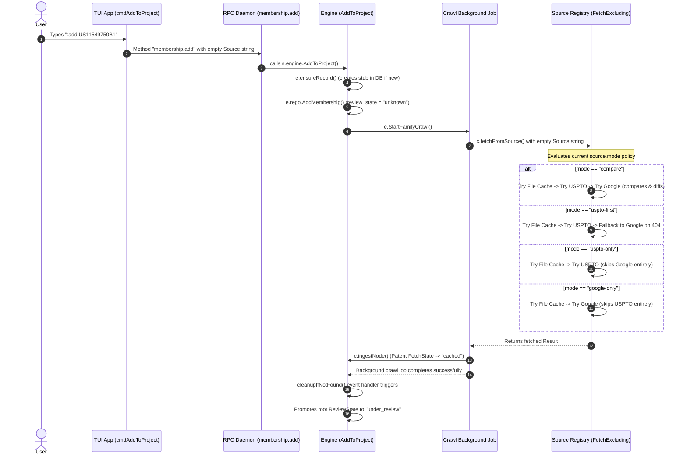

# TUI `:add` Execution Flow Sequence Diagram

This document contains the execution flow sequence diagram for the TUI `:add` command across all `source.mode` settings.

## Detailed Execution Steps:

1. **TUI Parsing & Invocation**:
   - The user inputs `:add US11549750B1`.
   - The TUI maps this to `AddToProject` command in `internal/command/catalog.go`.
   - The bubble tea handler `cmdAddToProject` in `internal/tui/app_commands.go` dispatches `pane.AddToProjectFromSourceCmd` with an empty source string (`""`).

2. **RPC Invocation**:
   - The client makes a `membership.add` RPC call using `proto.MembershipParams{Project: project, Patent: number, Source: ""}`.
   - The server handler `s.membershipAdd` in `internal/rpc/server.go` receives the call and delegates to `s.engine.AddToProject(ctx, p.Project, p.Patent)`.

3. **Engine-Side Ingestion**:
   - `AddToProject` in `internal/engine/engine_project.go` starts a background crawl via `e.StartFamilyCrawl(ctx, record, 0, domain.CrawlProfileAll, false)`.

4. **Background Crawl & `source.mode` Policy Enforcement**:
   - The crawl calls `c.fetchFromSource` which queries the `registry.FetchExcluding` method.
   - The registry enforces the configured `source.mode` (e.g. `compare`, `uspto-first`, `uspto-only`, `google-only`) to fetch from local/external sources.

5. **Post-Crawl Review State Promotion**:
   - Upon successful crawl, the patent gets saved as `cached`. Discovered citations are saved as `stub`.
   - The done event is caught by `cleanupIfNotFound` which automatically promotes the root patent's review state to `under_review`.
