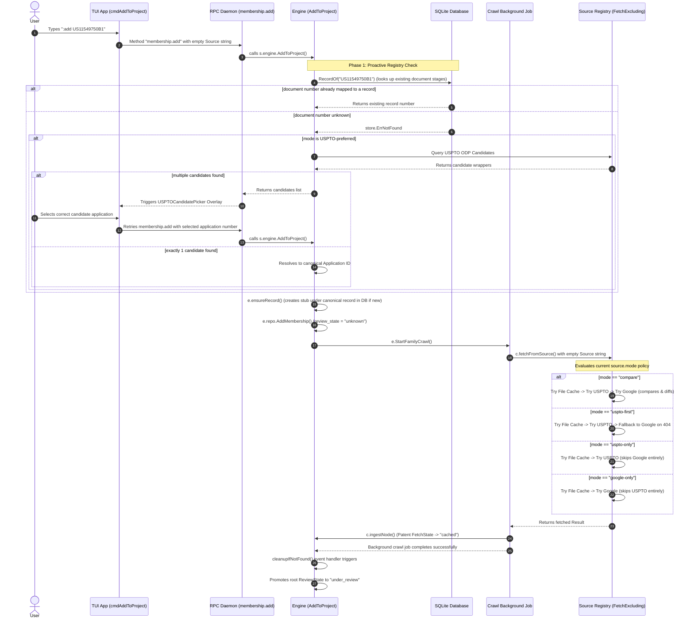

# TUI `:add` Execution Flow Sequence Diagram

This document contains the execution flow sequence diagram for the TUI `:add` command across all `source.mode` settings.

## Detailed Execution Steps:

1. **TUI Parsing & Invocation**:
   - The user inputs `:add US11549750B1`.
   - The TUI maps this to `AddToProject` command in `internal/command/catalog.go`.
   - The bubble tea handler `cmdAddToProject` in `internal/tui/app_commands.go` dispatches `pane.AddToProjectFromSourceCmd` with an empty source string (`""`).

2. **RPC Invocation**:
   - The client makes a `membership.add` RPC call using `proto.MembershipParams{Project: project, Patent: number, Source: ""}`.
   - The server handler `s.membershipAdd` in `internal/rpc/server.go` receives the call and delegates to `s.engine.AddToProject(ctx, p.Project, p.Patent)`.

3. **Proactive Registry Check & Candidate Resolution**:
   - Before writing any new record, the engine performs a proactive lookup `RecordOf` in the `document` table. If the document stage is already known to belong to a parent record, it reuses that record number directly.
   - If unknown and in a USPTO-preferred mode, the engine searches the USPTO ODP. If multiple application wrappers match, a `USPTOCandidatePicker` overlay is opened in the TUI so the user can select the correct application.
   - If exactly one application candidate is found, the engine automatically resolves the requested patent to the canonical Application ID before stub creation. This proactive mapping avoids creating duplicate stubs for different stages (publications vs grants) of the same invention.

4. **Engine-Side Ingestion**:
   - `AddToProject` in `internal/engine/engine_project.go` starts a background crawl via `e.StartFamilyCrawl(ctx, record, 0, domain.CrawlProfileAll, false)`.

5. **Background Crawl & `source.mode` Policy Enforcement**:
   - The crawl calls `c.fetchFromSource` which queries the `registry.FetchExcluding` method.
   - The registry enforces the configured `source.mode` (e.g. `compare`, `uspto-first`, `uspto-only`, `google-only`) to fetch from local/external sources.

6. **Post-Crawl Review State Promotion & Merging**:
   - Upon successful crawl, the patent gets saved as `cached`. Discovered citations are saved as `stub`.
   - During ingestion, any overlapping stub records are automatically resolved and deep-merged via `MergeRecords`.
   - The done event is caught by `cleanupIfNotFound` which automatically promotes the root patent's review state to `under_review`.
   - The addition trigger records a `membership_provenance` entry (`direct` for manual adds, `related` for family expansions, and `system`/`auto` for crawler operations).

