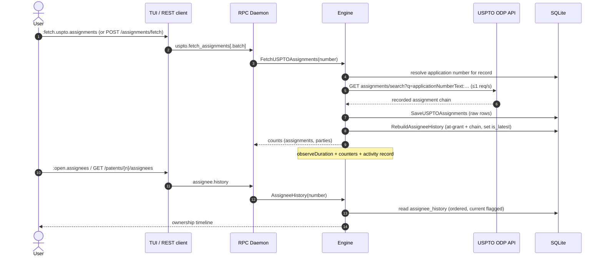

# Assignee & Ownership History — Usage & Flow

PatentMine tracks **who owns a patent and how that ownership changed over time**,
keyed to the stable record id and sourced **only** from the USPTO Open Data Portal
(`api.uspto.gov/api/v1/patent/assignments/search`, the API behind
`assignmentcenter.uspto.gov`). This guide explains the concepts, how to use the
commands and REST endpoints, what telemetry is recorded, and how batch runs are
optimized.

> **Implementation status.** The data layer (schema `assignee_history`, the
> derivation, the project rollup) and the backend (engine → proto → rpc → REST)
> are **shipped**. TUI: `:fetch.uspto.assignments` (single), `:open.assignees`,
> `:open.assignees.project` (rollup view), and `:fetch.uspto.assignments.project`
> (project batch) are **live**. Still in progress: enriching `:open.assignees` to
> render the per-patent timeline, plus `:export.assignees` and
> `:fetch.uspto.assignments.file`. Remote assignee-name search is **deferred**.
> For the daemon/server side of this flow, see
> [`DAEMON_ASSIGNEE_FLOW.md`](./DAEMON_ASSIGNEE_FLOW.md).

---

## 1. Concepts

A patent can have **multiple assignees in two different senses** — the model keeps
them distinct:

| Sense | Meaning | In the timeline |
|---|---|---|
| **Sequential** | Ownership changed hands over time (the recorded assignment chain). | One event per transfer; only the **latest** is current. |
| **Joint** | Several parties own the patent at the *same* time (USPTO `assignee_role` `04` = part interest). | Several rows share one event; **all** are current. |

Each timeline row carries a **pull type** (`at_grant` — the owner at grant; or
`assignment` — a recorded transfer), an **effective date** (grant date or recorded
date), and a **pulled-at** timestamp (when *we* fetched it). The current owner(s)
are the rows flagged `is_latest`.

**"Unique" assignees** are deduplicated by a normalized key
(`domain.NormalizeAssignee`: uppercased, depunctuated, org-suffix folded), so
`Acme Corp` and `Acme Corporation, Inc.` collapse into one group whose display
label is the most-frequent raw spelling.

**Expired patents are frozen.** A record whose `expiration_date` is in the past is
shown with its last-known owner but is **excluded from "current owners"** and is
**skipped by batch fetch** by default — there is no point re-pulling ownership for
a dead patent.

---

## 2. Per-patent: the ownership timeline

```text
:fetch.uspto.assignments     # pull the chain from USPTO ODP (rebuilds the timeline)
:open.assignees              # view the timeline for the selected patent
```

`:fetch.uspto.assignments` calls the USPTO assignment API for the patent's
application number, stores the raw chain, and **rebuilds** the record's
`assignee_history` (at-grant owner + each recorded assignee, current owner flagged).
`:open.assignees` (detail-scoped) shows that timeline: assignee · effective date ·
pull type · pulled-at, with the current owner(s) marked.

REST:

```text
GET /patents/{number}/assignees          # the timeline (assignee.history)
```

## 3. Project rollup: "all" vs "current" assignees

Answers *who owns this portfolio*:

- **Current owners** — deduplicated owners across **live** patents only.
- **All assignees ever** — every owner ever seen, with first/last dates and whether
  still current.
- Coverage buckets: live / expired (frozen) / not-fetched.

```text
:open.assignees.project      # open the rollup view (live)
:export.assignees [path]     # (in progress) write the rollup as a report
```

The view name is verb-first (`open.<object>.<qualifier>`), consistent with the
`open.assignees` family — not a bare `project.assignees` noun.

```text
GET  /projects/{id}/assignees          # the rollup (project.assignees)
```

Report shape:

```
Project: Acme Prior Art                       assignees · 2026-06-01

CURRENT OWNERS  (live patents only · 18)
  Acme Corporation .......................... 12   (2 joint w/ Initech)
  Globex LLC ................................  4
ALL ASSIGNEES EVER  (unique · 9)
  Acme Corporation     first 2015-03  last 2024-01   current ✓
  Stark Industries     first 2016-07  last 2019-02   transferred away
  Wayne Enterprises    first 2014-01  last 2020-05   frozen (expired 2023-11)
EXPIRED  (frozen · 5)            — excluded from current-owner totals
NOT FETCHED  (3)                 — run a batch fetch
```

## 4. Batch fetch over many patents

```text
:fetch.uspto.assignments.project [include-expired]   # the active project's members (live)
:fetch.uspto.assignments.file <path>                 # (in progress) a :add.file-style list
```

REST:

```text
POST /assignments/fetch                 # body {"numbers":["US…",…],"include_expired":false}
POST /projects/{id}/assignees/fetch     # body {"include_expired":false}
```

Both return `{ total, fetched, skipped, failed, assignments, parties, failures[] }`,
so a partial run never silently drops patents.

---

## 5. End-to-end flow



---

## 6. Telemetry, logs & timing

Every operation is observable, consistent with the rest of PatentMine
(see [`metrics.md`](./metrics.md) and [`ACTIVITY.md`](./ACTIVITY.md)):

| Signal | Where | What |
|---|---|---|
| **Timing** | store `observeDuration` | `store.sqlite.rebuild_assignee_history`, `store.sqlite.assignee_history`, `store.sqlite.project_assignees` (duration + failure flag). |
| **Timing** | engine `observeDuration` | `assignee.history`, `project.assignees`, `uspto.fetch_assignments` (single), `uspto.fetch_assignments_batch`. |
| **Counters** | engine `incCounter` | `uspto.fetch_assignments.{ok,error,records,parties}` (single); `uspto.fetch_assignments_batch.{total,fetched,skipped,failed}`. |
| **Logs** | engine `slog` | one structured line per fetch / batch (patent, application, counts; batch totals). |
| **Activity journal** | engine `recordActivity` | `uspto.fetch_assignments` and `uspto.fetch_assignments.batch` records with attributes (counts, skipped, failed), visible in the `H` history overlay and the activity feed. |
| **RPC timing** | rpc `observeRPC` | per-method latency for `assignee.history`, `project.assignees`, `uspto.fetch_assignments[.batch]`. |

Each `pulled_at` value on a timeline row is itself a data-level audit trail: it
records exactly when each assignee observation was captured.

---

## 7. Batch processing optimizations

Implemented:

- **Input dedup.** Several input spellings (application / publication / grant) can
  resolve to one record; the batch dedups by normalized number before fetching.
- **Skip expired.** Expired patents are skipped by default (`include_expired` to
  override) — ownership is frozen post-expiry, so a re-pull is wasted I/O.
- **Cheap local rebuild.** The per-record `assignee_history` rebuild is local SQL in
  one transaction; the network fetch dominates, not the derivation.
- **Cooperative cancellation.** The batch checks `ctx` between patents so a cancelled
  run stops promptly and still reports partial results.

The dominant cost is the USPTO ODP **1 request/second** rate limit, so throughput is
fetch-bound. Two further optimizations are tracked in [`TODO.md`](./TODO.md):

- **Bulk ODP queries** — the assignment search accepts a Lucene `OR` of several
  `applicationNumberText` values, so N applications can be pulled in one request
  (and one rate-limit slot), cutting request count substantially for large batches.
- **Freshness TTL** — skip patents whose `pulled_at` is within a staleness window so
  re-running a batch does not re-fetch everything.

Concurrency above the rate limit does **not** help (the 1 req/s cap is the
bottleneck), so the batch stays sequential and predictable rather than spawning
workers that would only queue behind the limiter.

---

## 8. Remaining

Tracked in [`TODO.md`](./TODO.md) and in-code `TODO(assignee-…)` markers:

- TUI wiring: enrich `:open.assignees` to render the per-patent timeline; add
  `:export.assignees` and `:fetch.uspto.assignments.file`. (The project rollup view
  `:open.assignees.project` and project batch `:fetch.uspto.assignments.project`
  are shipped.)
- Remote assignee-name **search** (`:find.assignee`, `GET /assignees/search`) via a new
  `crawl.SearchUSPTOAssignmentsByAssignee`.
- At-grant **joint** owners from `uspto_grant_party` (today the at-grant row uses the
  reconciled `record.assignee`).
- One-time **backfill** of `assignee_history` for corpora fetched before this feature.
- Bulk ODP queries + freshness TTL (see §7).
- Manual assignee **aliases** (deferred; auto-normalization only in v1).
