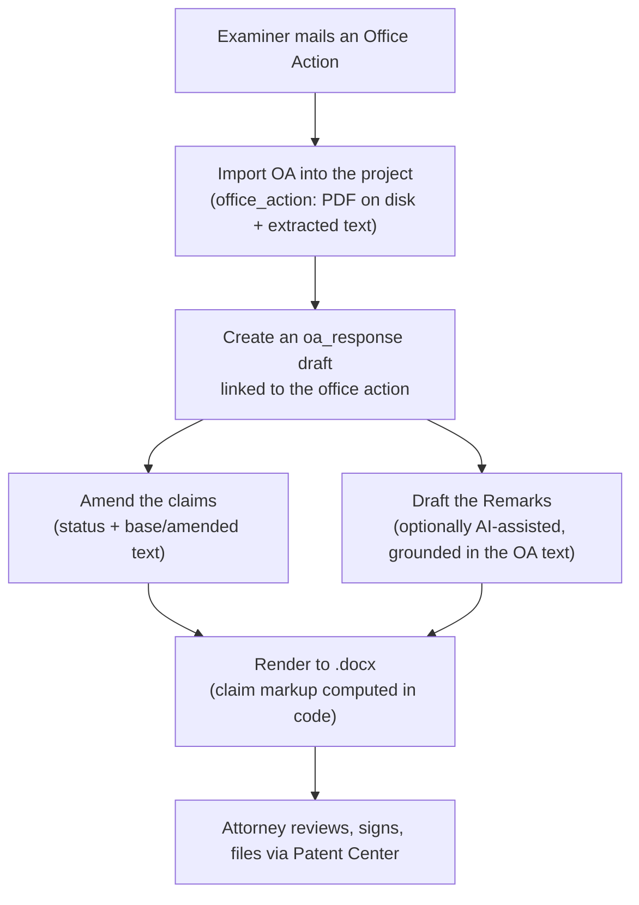
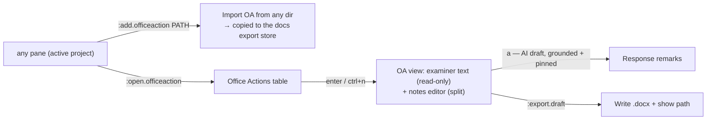

# PatentMine: Office Actions & Response Drafting

This guide covers the **office-action response** workflow: importing the
examiner's Office Action, building a response (amended claims + remarks), and
rendering it to **.docx** — with optional grounded AI drafting.

It is the office-action-focused companion to [`DRAFTING.md`](./DRAFTING.md),
which documents the underlying `Draft` model, the pure-Go `.docx` writer, and
the AI grounding internals shared by first-application drafting.

Related docs:

- [DRAFTING.md](./DRAFTING.md) — the unified drafting subsystem (model, docx, AI).
- [AI.md](./AI.md) — the multi-provider AI runtime (Gemini / Ollama).
- [TUI_ADD_FLOW.md](./TUI_ADD_FLOW.md) · [TUI_ASSIGNEE_FLOW.md](./TUI_ASSIGNEE_FLOW.md) — sibling project flows.

> [!NOTE]
> **Where the surface lives today.** The drafting/response internals run through
> the `patentmine draft` **CLI** and the daemon **RPC** (which also backs the web
> API). In the TUI the office action is now a **prosecution-matter workspace**
> reached through a dedicated **Office Actions pane** (`:open.officeaction`): a
> navigable table of the matter's office actions, `a` to import a new one, and
> `enter` to drill into a detail view (documents · timing · communications ·
> response). See [§7](#7-tui-integration).

---

## 1. The response lifecycle

An Office Action (OA) is the examiner's document rejecting or objecting to
claims under specific statutes (§101 eligibility, §102 novelty, §103
obviousness, §112 clarity). The applicant's **Response/Amendment** answers it
with amended claims (in the MPEP 714 marked-up listing) and remarks traversing
each rejection. PatentMine models the whole flow as a project-scoped draft:



Because an OA response is the same kind of artifact as a first application — a
project-scoped, section-structured document rendered to .docx — it reuses the
single `domain.Draft` model with `Kind = oa_response`. See
[DRAFTING.md §1](./DRAFTING.md#1-one-model-for-three-documents) for the schema.

---

## 2. Importing the Office Action

The examiner document is the thing a response argues over, so it is recorded
first as an `office_action` row tied to the project. **Manual import is the
always-works baseline**: the practitioner already has Patent Center access and
can download the OA, then point PatentMine at the file.

**Where the bytes live.** The document is copied onto disk under the docs export
base (`PATENTMINE_DOCS_EXPORT_DIR`, default `$HOME/exports`; the legacy
`PATENTMINE_IDS_EXPORT_DIR` is still honored) at
`<base>/<project>/office-actions/`, named `<officeActionID><ext>`, and a
**SHA-256 hash** is recorded for integrity. Only a pointer and metadata
(`blob_path`, `blob_hash`, mail date, type, examiner, art unit) plus the
**extracted text** live in the database row — the same pointer-in-row,
bytes-on-disk convention PatentMine uses for crawl snapshots, so the database
stays lean and backups stay fast. A `.txt` source doubles as the extracted text;
otherwise extracted text may be supplied explicitly.

**Default import directory.** The starting directory for the TUI file picker when importing office actions or supporting documents is configured via `PATENTMINE_IMPORT_FROM_DIR` in `.env` (e.g., `PATENTMINE_IMPORT_FROM_DIR=./import_from`). The TUI also tracks and opens at the last navigated folder during a session.


```bash
# Manual import (the baseline path)
patentmine draft oa-import --project p-123 \
  --file ./office-action.pdf \
  --type non_final \
  --examiner "Jane Doe" --art-unit 2151 \
  --app 16/123,456 --mail-date 2026-01-15 \
  --text "Claims 1-3 are rejected under 35 U.S.C. 103 as obvious over Smith..."

# List the office actions already on a project
patentmine draft oa-list --project p-123
```

Office-action types (`--type`): `non_final`, `final`, `restriction`,
`advisory`, `notice_of_allowance`.

> [!NOTE]
> **Text extraction.** A `.txt` source is read inline; a **PDF** is text-extracted
> by the pure-Go `internal/pdf` extractor (`ledongthuc/pdf`) on import. USPTO
> Office Actions are frequently **scanned, image-only PDFs** with no text layer —
> the extractor returns nothing for those, so `:open.documents` offers **`e`** to
> run **AI/OCR extraction** (Gemini multimodal) on demand, saving the transcribed
> text back to the document (and recording it as billable AI usage). **ODP
> auto-fetch** of the OA remains a deferred follow-up (see [§8](#8-follow-ups));
> manual import stays the always-works baseline.

---

## 3. Building the response

Create a draft of kind `oa-response` linked to the imported office action. It is
seeded with a **Remarks** section; an **Amendments to the Claims** listing is
rendered from the draft's claims.

```bash
# Create the response, linked to the office action from step 2
patentmine draft new --project p-123 --kind oa-response --oa oa-1737000000

# Inspect the seeded draft (sections, claims, link) as JSON
patentmine draft show --id d-1737000123
```

### 3.1 Amending the claims — markup is computed, not written

Each amended claim carries an MPEP 714 **status identifier** and, for a
currently-amended claim, both its prior text (`base_text`) and new text
(`text`). The renderer computes the **underline-insertion / strikethrough-
deletion** markup deterministically from a word-level diff of those two — in
code, never by the model — so the legal markup is always correct and a model can
never silently alter claim scope.

| Status | Label printed | Markup |
| --- | --- | --- |
| `original` | (Original) | none |
| `currently_amended` | (Currently Amended) | additions underlined, deletions struck |
| `new` | (New) | none (plain) |
| `cancelled` | (Cancelled) | claim body omitted |
| `withdrawn` | (Withdrawn) | none |

Claims are edited as structured data (via RPC `draft.save` / the web API, or the
TUI editor in [§7](#7-tui-integration)); `patentmine draft show` prints
the current claim set.

### 3.2 Drafting the remarks (grounded AI, optional)

AI drafting is opt-in, per section, and **never auto-saved** — the author
reviews, edits, and accepts. The model is grounded only in the draft's own
material, including the linked **office action's extracted text**, and is held to
the anti-hallucination rules described in
[DRAFTING.md §3](./DRAFTING.md#3-grounded-ai-drafting-and-how-it-avoids-hallucination):
use only the supplied material, mark anything unsupported with
`‹NEEDS ATTORNEY INPUT›`, and **reproduce pinned spans verbatim**.

```bash
# AI-draft the Remarks (section 0), pinning a phrase that must appear verbatim
patentmine draft ai --id d-1737000123 --section 0 \
  --instruction "Traverse the 103 rejection: Smith does not teach a self-cleaning surface." \
  --pin "a self-cleaning surface coating" \
  --note "Emphasize unexpected results from the coating."
```

The result is printed with its provider/model provenance, plus any **guardrail
problems** (a pinned span not reproduced, or `‹NEEDS ATTORNEY INPUT›` markers) on
stderr. An empty problem list means the mechanical checks passed — not that the
argument is correct, only that nothing was fabricated past the guardrails.

---

## 4. Rendering to .docx

```bash
patentmine draft export --id d-1737000123     # prints the written path
```

The response renders with the USPTO caption (application no., examiner, art unit,
attorney docket — pulled from the linked office action, falling back to the
project header), an **"Amendments to the Claims"** listing carrying the computed
markup, then the **Remarks**. Files land in `<export base>/<project>/` as
`oa_response-<timestamp>.docx`.

The database stays the source of truth and you **edit in-app until final**; the
.docx is a one-way handoff/redline artifact (no docx round-trip). USPTO now
accepts and incentivizes DOCX filing, so the editable .docx is the right final
artifact.

---

## 5. Confidentiality: local vs cloud AI

A response is attorney work product and may quote an **unpublished** application, so the provider choice matters. PatentMine supports local, Google, and OpenAI models:
- **Local Ollama**: Run this for privileged/pre-publication drafting where absolute data privacy is required.
- **Cloud Providers**: Opt into **Google Gemini** or **OpenAI (ChatGPT)** for already-published matters or when internet-based LLMs are preferred.

Selection is configured by environment variables:
- `PATENTMINE_AI_PROVIDER`: `"gemini"`, `"openai"`, or `"ollama"`
- `GEMINI_API_KEY`, `OPENAI_API_KEY`, `OPENAI_MODEL`
- `OLLAMA_HOST`, `OLLAMA_MODEL`

Provision the local path once:

```bash
cargo make ollama-setup     # installs Ollama + pulls the model
# or, aliased for drafting:
cargo make draft-setup
```

> [!TIP]
> **In-App Editing**: You can view and edit these variables directly inside the TUI settings screen (**`s`** key) using edit hotkeys like **`Shift+K`** (Gemini Key), **`Shift+O`** (OpenAI Key), **`Shift+H`** (Ollama Host), etc.

### How to View, Copy, and Export Notes
**`Ctrl+N` is the single notes key across the TUI.** What it opens depends on the
pane: in the **full-text viewer** it opens the **session notes buffer** (passages
captured with `:note.add`); in a patent **Catalog/Detail** view it opens that
patent's **persistent note**; in an **Office Action** detail it opens the
examiner-text / notes split editor.

All notes (attorney notes and generated AI reports) can be accessed and extracted in the TUI:
1. **Notes Buffer Overlay (`Ctrl+N`)**: In the **full-text viewer** press **`Ctrl+N`** to open the session notes buffer (it also auto-opens after an AI analysis). Press **`y`** to copy a single note, **`Y`** to copy all session notes, **`s`** to save them to the patent note, or **`F`** to flush them to the IDS.
2. **All Notes View (`:open.notes` Command)**: Type **`:open.notes`** (or alias **`:notes`**, or press **`Z`** / **`g n`**) to open a spreadsheet of all notes in the active project.
3. **Export to Markdown (`e` Key)**: In the **All Notes View**, press **`e`** to export all compiled project notes to a structured Markdown file (`patentmine-notes-*.md`) saved directly to your configured export directory.

> The tool drafts; the practitioner reviews, signs, and is responsible. AI text
> carries provenance (`ai_provider` / `ai_model`) and is never finalized for you.

---

## 6. Current surfaces (CLI · RPC · cargo-make)

### CLI (`patentmine draft …`, over the daemon)

| Command | Purpose |
| --- | --- |
| `draft oa-import --project <id> [--file …] [--type …] [--examiner …] [--art-unit …] [--app …] [--mail-date …] [--text …]` | Import an office action (copies the file, hashes it, captures text). |
| `draft oa-list --project <id>` | List a project's office actions. |
| `draft new --project <id> --kind oa-response [--oa <officeActionID>]` | Create a response draft linked to an OA. |
| `draft ai --id <draftID> --section <n> [--instruction …] [--note …] [--pin …]` | Grounded AI draft of one section (not saved). |
| `draft show --id <draftID>` | Print the draft (sections + claims) as JSON. |
| `draft export --id <draftID>` | Render the response to .docx; prints the path. |

### RPC methods (also back the web API)

`office_action.import`, `office_action.list`, `office_action.get`,
`office_action.save_notes`, `draft.create`, `draft.get`, `draft.list`,
`draft.save`, `draft.delete`, `draft.section.ai`, `draft.export.docx`.

Prosecution-matter workspace: `matter.document.import` / `.list` / `.rename` /
`.delete` / `.extract` (AI OCR), `matter.event.add` / `.list` / `.delete`
(communications log), `time_entry.log` / `.list` / `.unvalidated` / `.update` /
`.validate`-via-update / `.summary`, and `project.set_matter_type`.

### cargo-make

`cargo make draft <args>` forwards to the CLI; `cargo make draft-setup`
provisions the local AI path; `cargo make draft-demo` runs an end-to-end smoke
(`PROJECT_ID=p-123 cargo make draft-demo`).

---

## 7. TUI integration

All typed commands follow the **`<verb>.<object>`** convention — the same family
as `:add.file`, `:open.notes`, and `:export.ids.pdf` — so the verb leads
(`add` / `open` / `export`), never the object.

Intended flow, mirroring the AI curation overlay (`a`) and the IDS editor (`I`):



Typed commands (verb-first):

| Command | Maps to RPC | Action |
| --- | --- | --- |
| `:add.officeaction <path>` | `office_action.import` | Import an OA file from **any directory** into the active project; the file is copied into the docs export store (`<base>/<project>/office-actions/`) and hashed. |
| `:open.officeaction` | `office_action.list` | Open the project's Office Actions table. |
| `:add.draft <kind>` | `draft.create` | Create a draft (`provisional` / `nonprovisional` / `oa-response`). |
| `:export.draft <id>` | `draft.export.docx` | Render a draft to .docx and report the path. |

Inside the Office Actions table, drill in with `enter`, then open the notes
editor with `enter` / **`ctrl+n`**: a **split view** — the examiner
text on the left (read-only reference), an editable **notes** buffer on the right
— for annotating the rejection while drafting the response. AI drafting of the
response remarks is an in-view action (`a`), grounded in the OA text with
pin-span verbatim enforcement (see §3.2). Editor affordances mirror the IDS pane
in [README §9.G](./README.md#g-ids-curation-pane-bindings); wiring a new command
follows the recipe in [README §6](./README.md#6-tui-key-binding-architecture).

### Status — the prosecution-matter workspace (implemented)

The office action is now the centre of a matter workspace. The bytes-on-disk /
metadata-in-row convention extends to a **`matter_document`** table (many files
per matter) and the project gains a **matter type** stage; office actions gain a
**response deadline** (auto-computed from mail date + type) and a **status**.

| Command | What it does |
| --- | --- |
| `:open.officeaction` | The **Office Actions pane** — a table of the matter's office actions (mailed · type · examiner · response-due countdown · status). `↑/↓`/`j`/`k` move, `/` filters, `a` imports a new OA, `R` drafts a response, and **`enter` drills into the detail pane** (documents · timing · communications · response). |
| `:add.officeaction [path]` | Import an OA (also `a` in the pane). With no path it opens the hand-rolled **file picker** (`.pdf`/`.txt`); either way a **metadata form** then captures **examiner**, mail date, type, art unit, application number (pre-filled from the project). The file is copied + hashed + text-extracted, the response deadline computed, and the OA registered as the matter's first document. |
| `:add.document [path]` | File a supporting document (reference, prior response, …) under the matter (picker or path). |
| `:open.documents` | The matter's **document list**: `enter` views the text (read-only vim viewer), **`e`** runs AI/OCR on a scanned PDF, `r` renames, `d` deletes. |
| `:draft.response` | Create a `DraftOAResponse` linked to the latest OA and open the **split response editor**: matter documents on the left (`ctrl-n`/`ctrl-p` cycle), REMARKS on the right; **`yy`/`p`** copy a passage across, `ctrl+s` saves, `ctrl-e` exports the `.docx`. |
| `:log.comm` · `:open.comms` | Record / browse the **communications log** (email · phone · interview · filing · note — party + what happened). |
| `:set.matter <type>` | Set the project's prosecution stage (provisional / nonprovisional / in_prosecution / issued). |
| `:validate.time` | Review the **auto-captured time** queue: correct each entry's activity/duration/note, then validate (or delete). Reopening a matter with unvalidated time prompts here. |
| `:show.time` | Billing readout: recorded time by activity, validated/unvalidated split, and AI usage (calls + tokens). |
| `:log.time <activity> <duration> [note]` | Add a manual, validated time entry (duration: `30m`, `1h15m`, `1:15`, or plain minutes). |
| `:show.deadlines` | Cross-matter docket: pending OA responses + patent maintenance fees, soonest due first (`p` done, `x` dismiss). |
| `:track.renewals <patent>` | Track a granted patent's U.S. maintenance-fee deadlines (3.5 / 7.5 / 11.5 yr from grant). |

- **Split text/notes editor** (`:open.officeaction` → `enter`) — examiner
  **extracted text** on the left (read-only, vim-navigable), **notes** on the
  right (editable, vim NORMAL). `ctrl-w h/l/w` switches panes, `ctrl+s` saves
  (`office_action.save_notes`), `esc` closes. A shared **yank register** lets
  `yy` in the examiner pane `p`-paste into the notes. Both panes are the shared
  `vimBuffer`.
- **Office Actions pane + drill-down** (`:open.officeaction`) — the table above
  plus a **detail pane** (`enter`) showing the OA's metadata and response
  deadline, the matter's document/communication counts, and the **time + AI-usage
  tally** (with an "unvalidated — review before billing" cue). Detail keys: `f`
  documents · `c` communications · `R` draft response · `enter` / **`ctrl+n`**
  notes editor · **`T`** open the application's full text · `esc` back.
- **Full text while prosecuting** — `T` from the detail opens the application's
  full-text viewer (`[`/`]` switches stage, `/` `n` `N` search, `Ctrl+Q` match
  list). Across patents, the catalog's `Ctrl+F` full-text search scans **both**
  the as-filed publication (`…A1`) and the granted (`…B2`) text, so prior-art and
  claim-language searches cover either version — see
  [README §8.4](./README.md#84-view-source-xml-full-text-and-citations).
- **Time tracking + AI usage** — billable work is captured automatically: AI
  drafting and OCR calls log an `ai_usage` row + an auto, **unvalidated**
  `time_entry`, and the split editors record **reading** (left pane) vs
  **writing** (right pane) time on close. `:validate.time` is the **review queue**
  — correct each entry's activity/duration/note, then validate or delete it
  (captured time is a draft until a human signs off); reopening a matter with
  unvalidated time prompts here. `:show.time` is the billing readout and
  `:log.time` adds a manual entry. Every operation carries duration metrics +
  activity records (reusing the existing observability stack).
- **Deadlines + reminders** — one unified `deadline` model covers OA responses
  (auto-seeded from the mail date) and patent **maintenance fees**
  (`:track.renewals <patent>` derives the U.S. 3.5/7.5/11.5-yr schedule from the
  grant date). `:show.deadlines` is the cross-matter docket; opening a matter
  banners anything due soon. A pluggable `internal/remind` Notifier sends **email
  over SMTP** at 2 months / 15 days / 7 days before due (+ overdue), deduped and
  fired by a daily loop — opt-in via `PATENTMINE_REMINDER_EMAIL_*`; the in-app
  surface always works. Dates only (fee amounts deliberately not encoded). This
  is docketing assistance, not legal advice — verify all dates.

---

## 8. Assigning reference patents to an office action

Prosecuting an office action means reviewing prior-art / reference patents against
the examiner's rejections. PatentMine models this as a first-class many-to-many
link between patents and office actions (the `patent_office_action` join), keyed
by the patent's **canonical record number** so a link survives re-stamps and
record merges. An office action behaves like an *assignable label on patents* —
the same mental model as tags, but a typed reference rather than free text.

Each assignment carries a **review state** — `○ to review` → `✓ reviewed` — plus
the assignment date, and every assign/release is journaled. The glyph/label come
from one source (`domain.OAReviewStatus.Glyph()` / `.Label()`), so they read the
same everywhere.

### Two ways in

- **From the office action (bulk review).** Open the OA detail
  (`:open.officeaction` → `enter`) and press **`p`** for the two-pane
  **assignment view** — *Assigned to this office action* on top, *All patents in
  this matter* below. `tab` switches panes; in the lower table **`a`** assigns the
  patent under the cursor, in the upper **`x`** removes it and **`v`** toggles its
  review state; `enter` opens the patent; **`/`** searches the browse table by
  number / title / inventor / assignee; **`PageUp`/`PageDown`** (and `ctrl+u`/`d`)
  scroll; **`.`** sorts the focused column.
- **From the patent list or a patent (per-patent).** Select one or more patents in
  the **catalog** (visual mode `v` for a range) — or open a patent's **detail** —
  and run **`:assign.officeaction [name]`** (alias `:assign.oa`). This mirrors
  `:tag.patent.add <name>`: pass an office-action **name** to assign the selection
  directly to the matching action(s); with **no argument** a checkbox **picker**
  opens (**`space`** toggles, **`enter`** applies to the whole selection).
  **`:release.officeaction [name]`** is the inverse.

### Seeing assignments

- The **catalog** carries an **OA** column (matter view only): the assigned office
  action(s) with the review glyph (e.g. `Final 3/15 ✓ +1`). It is **sortable**
  (`.`) and **filterable** with the `oa:` field — `oa:any`, `oa:none`,
  `oa:to_review`, `oa:reviewed`, or `oa:<name>` (substring), combinable with
  `and`/`or`/`not` like any other [`:filter`](./README.md#filter-expression-syntax) term.
- The **patent detail** pane shows an **Office Actions** line listing the actions
  the patent is assigned to, with the same glyph.

### Carry-forward across the prosecution chain

When a new office action is **imported**, it automatically inherits the previous
office action's assigned patents — the most recent prior action in the same matter
and application — each reset to *to review*. So the references you vetted against
the non-final carry into the final without re-selecting them.

> [!NOTE]
> The data/RPC layer also exposes a manual *re-copy from previous* and a review
> CSV export (`office_action.copy_patents`, and a planned `:export.review`); these
> are not yet bound to TUI commands.

---

## 9. Follow-ups

- **Hourly rates / billing amounts** — time and AI usage are tracked as
  durations/counts now; attaching rates (per activity/timekeeper, and a
  $/1k-tokens AI rate) to produce dollar amounts and an invoice export is a later
  pass. Maintenance-fee **dollar amounts** likewise (entity-size dependent) — the
  dates are tracked; link to the live USPTO fee schedule rather than encode them.
- **Foreign annuities** — the `annuity` deadline kind exists; per-jurisdiction
  annual schedules (vs. the implemented U.S. maintenance math) are a follow-up.
- **ODP auto-fetch** of the Office Action when the API key is entitled (manual
  import remains the always-works baseline).
- **Structured rejections** (statute → claims → cited references) to drive a
  per-rejection response skeleton and per-reference grounding.
