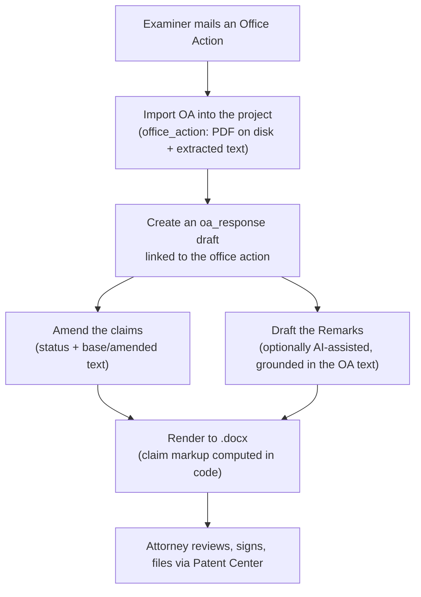
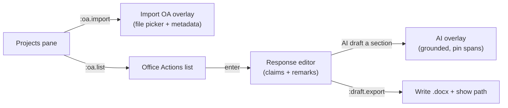

# PatentMine: Office Actions & Response Drafting

This guide covers the **office-action response** workflow: importing the
examiner's Office Action, building a response (amended claims + remarks), and
rendering it to **.docx** — with optional grounded AI drafting.

It is the office-action-focused companion to [`DRAFTING.md`](./DRAFTING.md),
which documents the underlying `Draft` model, the pure-Go `.docx` writer, and
the AI grounding internals shared by first-application drafting.

Related docs:

- [DRAFTING.md](./DRAFTING.md) — the unified drafting subsystem (model, docx, AI).
- [AI.md](./AI.md) — the multi-provider AI runtime (Gemini / Ollama).
- [TUI_ADD_FLOW.md](./TUI_ADD_FLOW.md) · [TUI_ASSIGNEE_FLOW.md](./TUI_ASSIGNEE_FLOW.md) — sibling project flows.

> [!NOTE]
> **Where the surface lives today.** The office-action response workflow runs
> through the `patentmine draft` **CLI** and the daemon **RPC** (which also backs
> the web API). The **in-TUI** surface — overlays and key bindings — is the
> planned integration sketched in [§7](#7-planned-tui-integration); it is not yet
> bound. Everything in §§1–6 works now via CLI/RPC.

---

## 1. The response lifecycle

An Office Action (OA) is the examiner's document rejecting or objecting to
claims under specific statutes (§101 eligibility, §102 novelty, §103
obviousness, §112 clarity). The applicant's **Response/Amendment** answers it
with amended claims (in the MPEP 714 marked-up listing) and remarks traversing
each rejection. PatentMine models the whole flow as a project-scoped draft:



Because an OA response is the same kind of artifact as a first application — a
project-scoped, section-structured document rendered to .docx — it reuses the
single `domain.Draft` model with `Kind = oa_response`. See
[DRAFTING.md §1](./DRAFTING.md#1-one-model-for-three-documents) for the schema.

---

## 2. Importing the Office Action

The examiner document is the thing a response argues over, so it is recorded
first as an `office_action` row tied to the project. **Manual import is the
always-works baseline**: the practitioner already has Patent Center access and
can download the OA, then point PatentMine at the file.

**Where the bytes live.** The document is copied onto disk under the docs export
base (`PATENTMINE_DOCS_EXPORT_DIR`, default `$HOME/exports`; the legacy
`PATENTMINE_IDS_EXPORT_DIR` is still honored) at
`<base>/<project>/office-actions/`, named `<officeActionID><ext>`, and a
**SHA-256 hash** is recorded for integrity. Only a pointer and metadata
(`blob_path`, `blob_hash`, mail date, type, examiner, art unit) plus the
**extracted text** live in the database row — the same pointer-in-row,
bytes-on-disk convention PatentMine uses for crawl snapshots, so the database
stays lean and backups stay fast. A `.txt` source doubles as the extracted text;
otherwise extracted text may be supplied explicitly.

```bash
# Manual import (the baseline path)
patentmine draft oa-import --project p-123 \
  --file ./office-action.pdf \
  --type non_final \
  --examiner "Jane Doe" --art-unit 2151 \
  --app 16/123,456 --mail-date 2026-01-15 \
  --text "Claims 1-3 are rejected under 35 U.S.C. 103 as obvious over Smith..."

# List the office actions already on a project
patentmine draft oa-list --project p-123
```

Office-action types (`--type`): `non_final`, `final`, `restriction`,
`advisory`, `notice_of_allowance`.

> [!NOTE]
> **Coverage & extraction.** The USPTO ODP file-wrapper coverage is partial, and
> older Office Actions are scanned images (needing OCR), so **ODP auto-fetch** and
> **PDF/OCR text extraction** are deferred follow-ups (see [§8](#8-follow-ups)).
> Manual import with supplied/`.txt` text is the dependable path today and keeps
> the build pure-Go.

---

## 3. Building the response

Create a draft of kind `oa-response` linked to the imported office action. It is
seeded with a **Remarks** section; an **Amendments to the Claims** listing is
rendered from the draft's claims.

```bash
# Create the response, linked to the office action from step 2
patentmine draft new --project p-123 --kind oa-response --oa oa-1737000000

# Inspect the seeded draft (sections, claims, link) as JSON
patentmine draft show --id d-1737000123
```

### 3.1 Amending the claims — markup is computed, not written

Each amended claim carries an MPEP 714 **status identifier** and, for a
currently-amended claim, both its prior text (`base_text`) and new text
(`text`). The renderer computes the **underline-insertion / strikethrough-
deletion** markup deterministically from a word-level diff of those two — in
code, never by the model — so the legal markup is always correct and a model can
never silently alter claim scope.

| Status | Label printed | Markup |
| --- | --- | --- |
| `original` | (Original) | none |
| `currently_amended` | (Currently Amended) | additions underlined, deletions struck |
| `new` | (New) | none (plain) |
| `cancelled` | (Cancelled) | claim body omitted |
| `withdrawn` | (Withdrawn) | none |

Claims are edited as structured data (via RPC `draft.save` / the web API, or the
TUI editor in [§7](#7-planned-tui-integration)); `patentmine draft show` prints
the current claim set.

### 3.2 Drafting the remarks (grounded AI, optional)

AI drafting is opt-in, per section, and **never auto-saved** — the author
reviews, edits, and accepts. The model is grounded only in the draft's own
material, including the linked **office action's extracted text**, and is held to
the anti-hallucination rules described in
[DRAFTING.md §3](./DRAFTING.md#3-grounded-ai-drafting-and-how-it-avoids-hallucination):
use only the supplied material, mark anything unsupported with
`‹NEEDS ATTORNEY INPUT›`, and **reproduce pinned spans verbatim**.

```bash
# AI-draft the Remarks (section 0), pinning a phrase that must appear verbatim
patentmine draft ai --id d-1737000123 --section 0 \
  --instruction "Traverse the 103 rejection: Smith does not teach a self-cleaning surface." \
  --pin "a self-cleaning surface coating" \
  --note "Emphasize unexpected results from the coating."
```

The result is printed with its provider/model provenance, plus any **guardrail
problems** (a pinned span not reproduced, or `‹NEEDS ATTORNEY INPUT›` markers) on
stderr. An empty problem list means the mechanical checks passed — not that the
argument is correct, only that nothing was fabricated past the guardrails.

---

## 4. Rendering to .docx

```bash
patentmine draft export --id d-1737000123     # prints the written path
```

The response renders with the USPTO caption (application no., examiner, art unit,
attorney docket — pulled from the linked office action, falling back to the
project header), an **"Amendments to the Claims"** listing carrying the computed
markup, then the **Remarks**. Files land in `<export base>/<project>/` as
`oa_response-<timestamp>.docx`.

The database stays the source of truth and you **edit in-app until final**; the
.docx is a one-way handoff/redline artifact (no docx round-trip). USPTO now
accepts and incentivizes DOCX filing, so the editable .docx is the right final
artifact.

---

## 5. Confidentiality: local vs cloud AI

A response is attorney work product and may quote an **unpublished**
application, so the provider choice matters. PatentMine supports **both**: run
**local Ollama** for privileged/pre-publication drafting, and opt into **cloud
Gemini** for already-published matters. Selection is by config
(`PATENTMINE_AI_PROVIDER`, `GEMINI_API_KEY`, `OLLAMA_HOST`/`OLLAMA_MODEL`).
Provision the local path once:

```bash
cargo make ollama-setup     # installs Ollama + pulls the model
# or, aliased for drafting:
cargo make draft-setup
```

> The tool drafts; the practitioner reviews, signs, and is responsible. AI text
> carries provenance (`ai_provider` / `ai_model`) and is never finalized for you.

---

## 6. Current surfaces (CLI · RPC · cargo-make)

### CLI (`patentmine draft …`, over the daemon)

| Command | Purpose |
| --- | --- |
| `draft oa-import --project <id> [--file …] [--type …] [--examiner …] [--art-unit …] [--app …] [--mail-date …] [--text …]` | Import an office action (copies the file, hashes it, captures text). |
| `draft oa-list --project <id>` | List a project's office actions. |
| `draft new --project <id> --kind oa-response [--oa <officeActionID>]` | Create a response draft linked to an OA. |
| `draft ai --id <draftID> --section <n> [--instruction …] [--note …] [--pin …]` | Grounded AI draft of one section (not saved). |
| `draft show --id <draftID>` | Print the draft (sections + claims) as JSON. |
| `draft export --id <draftID>` | Render the response to .docx; prints the path. |

### RPC methods (also back the web API)

`office_action.import`, `office_action.list`, `office_action.get`,
`draft.create`, `draft.get`, `draft.list`, `draft.save`, `draft.delete`,
`draft.section.ai`, `draft.export.docx`.

### cargo-make

`cargo make draft <args>` forwards to the CLI; `cargo make draft-setup`
provisions the local AI path; `cargo make draft-demo` runs an end-to-end smoke
(`PROJECT_ID=p-123 cargo make draft-demo`).

---

## 7. Planned TUI integration

> [!IMPORTANT]
> The commands and bindings below are the **proposed** in-TUI surface, kept
> consistent with the existing project/IDS/tag conventions (object-first typed
> commands like `:project.create`, `:tag.add`). They are **not yet bound** — the
> backend, RPC, and CLI exist today; the overlays are the next step.

Intended flow, mirroring the AI curation overlay (`a`) and the IDS editor (`I`):



Proposed typed commands (verb-/object-consistent with siblings):

| Proposed command | Maps to RPC | Action |
| --- | --- | --- |
| `:oa.import` | `office_action.import` | Open the import overlay (file + metadata). |
| `:oa.list` | `office_action.list` | Open the project's Office Actions list. |
| `:draft.create` | `draft.create` | Create a draft (kind picker: provisional / nonprovisional / oa-response). |
| `:draft.ai` | `draft.section.ai` | AI-draft the focused section, with a pin-span affordance. |
| `:draft.export` | `draft.export.docx` | Render the focused draft to .docx. |

Proposed editor affordances (consistent with the IDS pane in
[README §9.G](./README.md#g-ids-curation-pane-bindings)): cycle a claim's
amendment status, edit base/amended text, toggle a section's pinned spans, and a
review badge when an AI draft still has unresolved guardrail problems. Wiring a
new command follows the standard recipe in
[README §6](./README.md#6-tui-key-binding-architecture).

---

## 8. Follow-ups

- **TUI overlays** for the flow in §7 (today: CLI / RPC / web).
- **ODP auto-fetch** of the Office Action when the API key is entitled (manual
  import remains the always-works baseline).
- **PDF text extraction / OCR** for scanned Office Actions — currently a `.txt`
  source doubles as extracted text, or text is supplied with `--text`; PDF/OCR
  would add an external dependency, deliberately kept out of the pure-Go build.
- **Structured rejections** (statute → claims → cited references) to drive a
  per-rejection response skeleton and per-reference grounding.
