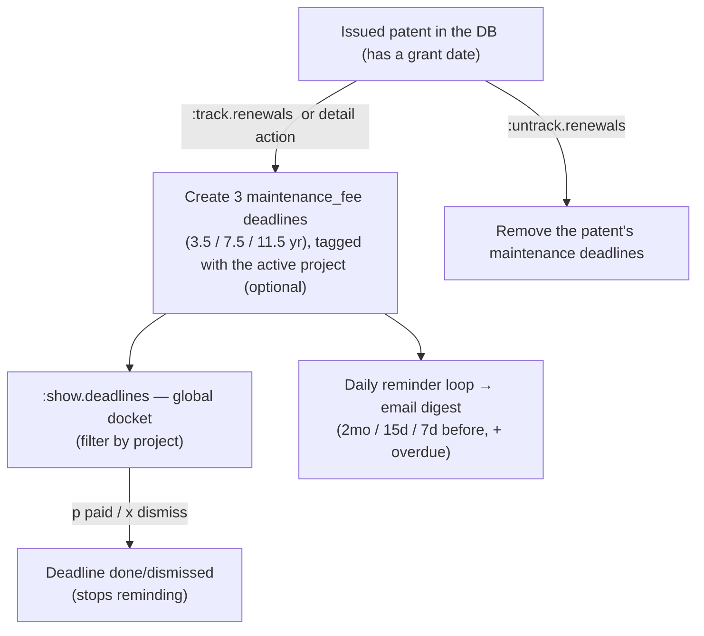

# PatentMine: Patent Renewals & Maintenance-Fee Tracking

This guide covers tracking **which patents to watch for renewal / maintenance-fee
payments** and how reminders are delivered. It is the renewals-focused companion
to [`TUI_OFFICE_ACTION.md`](./TUI_OFFICE_ACTION.md) (the prosecution-matter
workspace) and shares the unified **deadline** model and the pluggable reminder
engine documented there.

> [!WARNING]
> **This feature is in progress.** The maintenance-fee *date math* and the
> reminder pipeline are implemented; how patents are *designated* for tracking
> (and the surfaces to manage that set) are partially built. See
> [§6 TODO](#6-todo). PatentMine is a **docketing assistant, not a docketing
> system of record** — verify every date against the USPTO. This is not legal
> advice.

---

## 1. What exists today (from the deadlines slice)

- **`deadline` table** — one row per tracked due date. Columns include `kind`
  (`oa_response` / `maintenance_fee` / `annuity` / `custom`), `patent_number`,
  `project_id` (currently unset for renewals), `window_opens`, `due_date`,
  `grace_ends`, `status` (`pending` / `done` / `dismissed`).
- **`domain.USMaintenanceDeadlines(patentNumber, grantDate)`** — derives the
  three U.S. utility-patent maintenance windows from the grant date: **3.5 / 7.5 /
  11.5 years**, each with the **6-month pay window before** (`window_opens`) and
  the **6-month surcharge grace after** (`grace_ends`).
- **`:track.renewals <patent-number>`** → `engine.TrackRenewals` looks up the
  patent, reads its grant date, and (re)creates its three `maintenance_fee`
  deadlines. Re-running replaces them so it never double-tracks.
- **`:show.deadlines`** — the cross-matter docket: every pending deadline
  (OA responses + maintenance fees), soonest due first, overdue/due-soon cues;
  `p` marks done, `x` dismisses.
- **Reminders** — the pluggable `internal/remind` `Notifier` sends an **SMTP email
  digest** at **2 months / 15 days / 7 days** before due (+ overdue), deduped via
  `reminder_log`, on a daily loop. Opt-in via `PATENTMINE_REMINDER_EMAIL_*`; the
  in-app docket always works.

**So today, "the set of patents tracked for renewal" = "the set of patents that
have pending `maintenance_fee` deadline rows."** Tracking is already per-patent;
what is missing is the management surface (untrack, list, group, scope to a
project, selective bulk-track) and the polish in [§6](#6-todo).

---

## 2. The question: how do we designate which patents to track?

A practitioner does **not** pay maintenance on every patent in the database — only
on the issued patents they (or their client) own and choose to keep alive. So we
need an explicit, curated "tracked for renewal" set. Three ways to model it:

### Approach A — A dedicated "Renewals" project (the patents are its members)

Create a special project; add the patents-to-track as members; renewal tracking
applies to that project's membership.

**Pros**
- Reuses the existing **project + membership** machinery and the projects pane.
- A project is already a curated set of patents, so "the tracked set" is just "its
  members."
- Easy to scope `:show.deadlines` to one project.

**Cons**
- **Conflates two meanings of "project."** A project today is a *body of work* —
  typically one filing for which an IDS is generated. A maintenance watchlist is a
  different thing (a portfolio of *granted* patents you are paying fees on).
- A patent can belong to **several projects, or none** — but its maintenance
  obligation is singular and intrinsic. Which project "owns" the renewal?
- Forces the portfolio user to create an artificial project; forces the
  prosecution user to mix issued-patent fee-watching into a prosecution matter.
- "Track only *some* members" then needs a per-member flag anyway — so the project
  is not actually the unit of tracking.

### Approach B — Per-patent tracking (the patent/grant is the unit)

A patent is tracked iff it has pending `maintenance_fee` deadlines.
`:track.renewals` creates them (tracks); an untrack action removes/dismisses them.
**This is what is built today.**

**Pros**
- **Matches reality**: maintenance is a property of the *granted patent* (its
  grant date), independent of any project.
- The `deadline` rows already key on `patent_number`; the tracked set falls out
  for free.
- Works for a pure **portfolio** user with no prosecution projects at all.

**Cons**
- No grouping/organization (by client, by matter) unless added.
- "Which patents am I tracking?" needs a dedicated list view (derivable from the
  deadline rows, but not yet surfaced as a watchlist).

### Approach C — Per-patent tracking + *optional* project tag (recommended)

Tracking is per-patent (Approach B is the primitive). When you track from within a
project, the deadline rows are **tagged** with that `project_id` for grouping and
filtering — but a project is **never required**, and a patent can be tracked
standalone. `:show.deadlines` is global by default and filterable by the active
project.

**Pros**
- Best of both: the correct per-patent primitive **plus** the optional
  client/matter lens you asked for.
- Directly supports **"a specific project, and only some of its patents"**: inside
  a project you selectively `:track.renewals` the members you want; the deadline
  rows carry the project tag; the rest are untracked.
- No overloading of "project"; reuses the existing `deadline.project_id` column
  (already present, currently unused for renewals).
- Degrades gracefully to pure portfolio tracking (no project tag).

**Cons**
- A little more logic: optional project tagging, a project-filtered docket view, an
  explicit untrack, and a "tracked patents" list.

---

## 3. Recommendation

**Adopt Approach C.** Keep tracking **per-patent** (the maintenance-fee deadline
rows are the source of truth) and add an **optional project association** for
organizing by client/matter. Concretely:

- `:track.renewals <patent>` (and a patent-detail action) tags the created
  deadlines with the **active project** when there is one, leaving it empty
  otherwise. Tracking never *requires* a project.
- A patent is "tracked for renewal" exactly when it has pending `maintenance_fee`
  deadlines; an **`:untrack.renewals <patent>`** removes/dismisses them.
- `:show.deadlines` stays the global docket; add a **project filter** so a matter
  shows only its tagged renewals, and add a **renewals watchlist** view (the
  distinct list of tracked patents with their next due date).

This reconciles your idea — *scope to a project, track only some patents* — without
making "project" the unit of tracking. A "dedicated Renewals project" remains a
fine **convention** a user can adopt (a project whose members they all track), but
it is not the mechanism.

---

## 4. Data model

Current (implemented):

```
deadline(id, kind, patent_number, project_id, office_action_id,
         title, window_opens, due_date, grace_ends, status, ...)
reminder_log(subject, threshold_days, channel, sent_at)   -- dedupe
```

Proposed deltas for Approach C (small; mostly using what exists):

- **Populate `deadline.project_id`** in `TrackRenewals` from the active project
  (already a column; engine input needs the project threaded through).
- Optionally record **entity size** (large / small / micro) and **paid-on / next
  amount** per patent — but only when we add fee *amounts*; dates need none of it.
- A patent is granted/utility-only check before tracking (design patents and
  provisionals have no maintenance fees).

No new tables are required for the core; the watchlist is a query over
`deadline WHERE kind='maintenance_fee' AND status='pending'`.

---

## 5. Workflow (target)



- **Selective, per-project**: open a project, then `:track.renewals` the specific
  member patents to watch. The docket filtered to that project shows just those.
- **Portfolio**: track patents with no active project; the global docket is your
  whole renewal book.

---

## 6. TODO

Tracking primitive + management surfaces (Approach C):

- [ ] **Project tag on renewals**: thread the active project into
  `TrackRenewals` so created deadlines carry `project_id` (the column already
  exists; `proto.TrackRenewalsParams` + `engine.TrackRenewals` need a project
  field, and `cmdTrackRenewals` should pass `a.activeProject`).
- [ ] **`:untrack.renewals <patent>`** — delete/dismiss a patent's
  `maintenance_fee` deadlines (engine + RPC + command).
- [ ] **Renewals watchlist view** — a distinct list of tracked patents (one row
  per patent: number, title, next maintenance due, project) rather than one row
  per deadline; `:show.renewals` or a tab in the deadlines view.
- [ ] **Project-filtered docket** — `:show.deadlines` honors the active project
  (and a "all matters" toggle).
- [ ] **Patent-detail integration** — show a patent's maintenance schedule in the
  detail pane and offer a `track / untrack` action there (the natural place,
  since renewal is a property of the patent).
- [ ] **Selective bulk-track** — from a project / catalog selection, track the
  chosen granted members in one action (and a guard that skips non-granted /
  non-utility patents).

Correctness / coverage:

- [ ] **Granted-utility guard** — only utility patents accrue U.S. maintenance
  fees; skip design (D), plant (PP), reissue nuances, and any non-granted record,
  with a clear message.
- [ ] **Window-open reminder** — also remind when the 6-month pay window *opens*
  (not only the N-days-before-due thresholds), since paying early avoids surcharge.
- [ ] **Entity size & fee amounts** — capture large/small/micro and surface the
  *current* USPTO fee amount (link to the live fee schedule rather than encode
  dollar values, which change and would go stale).
- [ ] **Paid provenance** — when marking a fee paid, record the date (and
  optionally a receipt/confirmation) rather than only flipping status to `done`.

Beyond U.S.:

- [ ] **Foreign annuities** — the `annuity` deadline kind exists but has no
  computation; add per-jurisdiction annual schedules (these are yearly, unlike the
  U.S. 3-window model) or allow manual/custom entry.

Operational:

- [ ] **Auto-track on grant** (optional) — when a patent is added as / becomes
  granted, offer to start tracking its renewals.
- [ ] **Reminder cadence config** — the thresholds (60/15/7) and the daily-loop
  interval are engine defaults; expose them in config.
- [ ] **Tests** — engine project-tagging + untrack; the granted-utility guard;
  window-open reminder logic.

---

## 7. Caveats

- **Docketing assistance, not a system of record.** Missing a maintenance fee can
  abandon a patent; do not rely solely on this. Verify every date against the
  USPTO Patent Maintenance Fees system.
- **U.S. utility only** for the computed schedule; everything else is manual /
  custom for now.
- **Dates, not dollars** — fee amounts depend on entity size and the current fee
  schedule and are intentionally not encoded.

Related: [`TUI_OFFICE_ACTION.md`](./TUI_OFFICE_ACTION.md) (deadline model +
reminder engine), [`EXPIRATION_DATE.md`](./EXPIRATION_DATE.md) (the term/expiration
math that also keys off the grant date).
