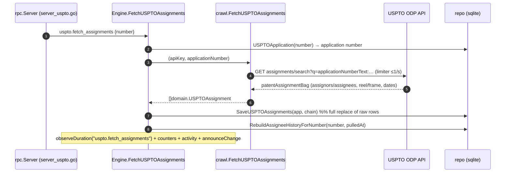

# Daemon-Side Assignee & Ownership Flow

This is the **server side** of assignee tracking — what happens inside the
`patentmine serve` daemon when an assignee request arrives. For the user-facing
commands and concepts, see [`10_TUI_ASSIGNEE_FLOW.md`](./10_TUI_ASSIGNEE_FLOW.md); for
the broader architecture, [`01_README.md`](./01_README.md).

Every assignee operation is the same four layers: **rpc dispatch → engine →
crawl (USPTO ODP) / store → SQLite**, with telemetry emitted at each hop. Only the
USPTO Open Data Portal is contacted for assignment data.

---

## 1. Components

| Layer | File | Role |
|---|---|---|
| RPC dispatch | `internal/rpc/server.go` (registry) · `internal/rpc/server_uspto.go` (handlers) | Decode proto params, call the engine. |
| Engine | `internal/engine/engine_uspto.go` | Orchestrate fetch/save/rebuild and reads; own telemetry. |
| Crawl (ODP) | `internal/crawl/assignments.go` | `FetchUSPTOAssignments` → `api.uspto.gov/.../assignments/search`, rate-limited ≤1 req/s. |
| Store — raw | `internal/store/sqlite/uspto_assignment.go` | `SaveUSPTOAssignments` (full-replace `uspto_assignment` + parties). |
| Store — derived | `internal/store/sqlite/assignee_history.go` | `RebuildAssigneeHistory`, `AssigneeHistory`, `ProjectAssignees`. |
| Schema | `internal/store/sqlite/schema.sql` · `migrate.go` (`migrateV5ToV6`) | `assignee_history` table, schema v6. |
| Domain | `internal/domain/assignee.go` | `NormalizeAssignee`, `AssigneeHistoryEntry`, `ProjectAssigneeRollup`, `PullType*`. |

Proto methods (`internal/proto/proto.go`): `uspto.fetch_assignments`,
`uspto.fetch_assignments.batch`, `assignee.history`, `project.assignees`,
`uspto.assignment.list`.

---

## 2. Write path: fetch → save → rebuild

`SaveUSPTOAssignments` is a full replacement keyed by `application_number`
(cascading to `uspto_assignment_party`). The engine then calls
`RebuildAssigneeHistoryForNumber`, which stamps a `pulled_at` timestamp.

## 3. The derivation (`RebuildAssigneeHistory`)

Recomputes one record's `assignee_history` in a single transaction
(delete-then-insert), keyed off the **surrogate `record.id`** so it survives
number canonicalization / merges:

1. **At-grant row** — from `record.assignee` (the reconciled projection);
   `effective_date` = the record's grant date; `pull_type = at_grant`.
   *(`TODO(assignee-atgrant)`: take joint at-grant owners from `uspto_grant_party`.)*
2. **Assignment rows** — every `assignee`-role party of every recorded assignment
   belonging to the record's applications (`uspto_assignment` ⋈ `uspto_application`
   on `record_id`), ordered oldest-first by recorded date; `pull_type = assignment`,
   `reel_frame` carried through.
3. **`is_latest`** — set on **every party of the most-recent event** (max
   `effective_date`, tie-break by assignment ordinal); falls back to the at-grant
   row when there are no assignments. Multiple `is_latest` rows ⇒ joint owners.
4. Each row stores `assignee_norm = domain.NormalizeAssignee(name)` — the dedup key
   for "unique" rollups (upper, depunctuated, org-suffix folded).

Dates are normalized to `domain.DateLayout` (`normalizeAssigneeDate`) so lexical
comparison orders events correctly.

## 4. Read paths

- **`assignee.history`** → `Engine.AssigneeHistory` → `repo.AssigneeHistory(number)`:
  joins `assignee_history` to `record` by number, returns the timeline ordered by
  `effective_date, pull_type, ordinal` with `is_latest` flagged.
- **`project.assignees`** → `Engine.ProjectAssignees` → `repo.ProjectAssignees`:
  one query joins `membership → record → assignee_history`; Go aggregates into
  current-owner groups (deduped by `assignee_norm`, **live** patents only),
  all-ever groups (first/last/current), and live/expired/not-fetched counts. A
  record is *expired* when `expiration_date != '' AND expiration_date < today`.

## 5. Batch path (`FetchUSPTOAssignmentsBatch`)

`uspto.fetch_assignments.batch` carries either an explicit `numbers` list or a
`project` (the rpc handler routes a project to `FetchUSPTOAssignmentsForProject`,
which enumerates curated members via `ManualMemberships`). The engine then:

1. **Dedups** input by normalized number (many spellings → one record).
2. **Skips expired** records (unless `include_expired`) via a cheap
   `repo.Patent` expiration check.
3. Runs each through the single-patent `FetchUSPTOAssignments` (so the ODP limiter
   and the history rebuild apply per record), checking `ctx` between patents.
4. Aggregates `{total, fetched, skipped, failed, assignments, parties, failures[]}`.

The dominant cost is the ODP **1 req/s** cap, so the loop is sequential by design.
Planned: bulk ODP queries (`OR` of several `applicationNumberText`) and a
freshness TTL — see [`20_TODO.md`](./20_TODO.md).

## 6. Telemetry emitted by the daemon

| Signal | Name | Layer |
|---|---|---|
| Timing | `store.sqlite.rebuild_assignee_history` · `…assignee_history` · `…project_assignees` | store `observeDuration` |
| Timing | `assignee.history` · `project.assignees` · `uspto.fetch_assignments` · `uspto.fetch_assignments_batch` | engine `observeDuration` |
| Counters | `uspto.fetch_assignments.{ok,error,records,parties}` · `uspto.fetch_assignments_batch.{total,fetched,skipped,failed}` | engine `incCounter` |
| RPC latency | per-method via `observeRPC` (slow-method threshold logged) | rpc dispatch |
| Logs | structured `slog` line per fetch/batch (patent, application, counts) | engine |
| Activity journal | `uspto.fetch_assignments` and `uspto.fetch_assignments.batch` records (`observability.Record`) | engine `recordActivity` |
| Bus event | `announceChange()` after a fetch so connected clients refresh | engine |

See [`07_metrics.md`](./07_metrics.md) and [`08_ACTIVITY.md`](./08_ACTIVITY.md) for the metrics
and activity subsystems these feed.

## 7. Migration

`migrateV5ToV6` (`internal/store/sqlite/migrate.go`) is additive: it creates the
`assignee_history` table and bumps the schema version 5 → 6. Existing databases
populate the timeline lazily on the next assignment fetch per record;
`TODO(assignee-backfill)` tracks a one-time backfill from already-stored
`uspto_assignment` rows.
