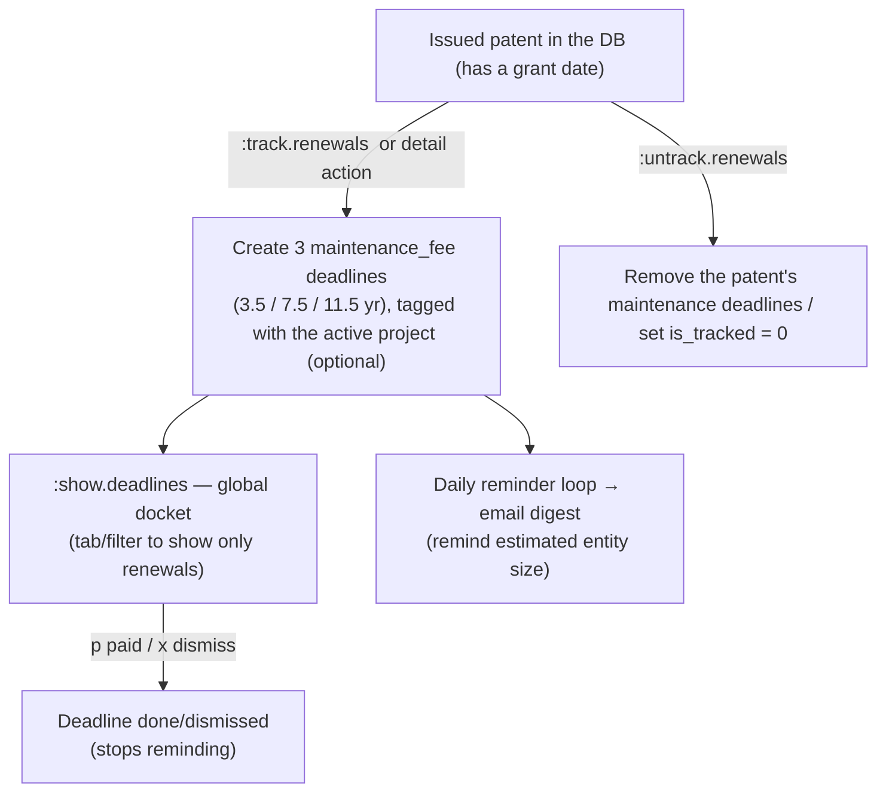

# PatentMine: Patent Renewals & Maintenance-Fee Tracking

This guide covers tracking **which patents to watch for renewal / maintenance-fee
payments** and how reminders are delivered. It is the renewals-focused companion
to [`13_TUI_OFFICE_ACTION.md`](./13_TUI_OFFICE_ACTION.md) (the prosecution-matter
workspace) and shares the unified **deadline** model and the pluggable reminder
engine documented there.

> [!WARNING]
> **This feature is in progress.** The maintenance-fee *date math* and the
> reminder pipeline are implemented; how patents are *designated* for tracking
> (and the surfaces to manage that set) are partially built. See
> [§6 TODO](#6-todo). PatentMine is a **docketing assistant, not a docketing
> system of record** — verify every date against the USPTO. This is not legal
> advice.

---

## 1. What exists today (from the deadlines slice)

- **`deadline` table** — one row per tracked due date. Columns include `kind`
  (`oa_response` / `maintenance_fee` / `annuity` / `custom`), `patent_number`,
  `project_id` (currently unset for renewals), `window_opens`, `due_date`,
  `grace_ends`, `status` (`pending` / `done` / `dismissed`).
- **`domain.USMaintenanceDeadlines(patentNumber, grantDate)`** — derives the
  three U.S. utility-patent maintenance windows from the grant date: **3.5 / 7.5 /
  11.5 years**, each with the **6-month pay window before** (`window_opens`) and
  the **6-month surcharge grace after** (`grace_ends`).
- **`:track.renewals <patent-number>`** → `engine.TrackRenewals` looks up the
  patent, reads its grant date, and (re)creates its three `maintenance_fee`
  deadlines. Re-running replaces them so it never double-tracks.
- **`:show.deadlines`** — the cross-matter docket: every pending deadline
  (OA responses + maintenance fees), soonest due first, overdue/due-soon cues;
  `p` marks done, `x` dismisses.
- **Reminders** — the pluggable `internal/remind` `Notifier` sends an **SMTP email
  digest** at **2 months / 15 days / 7 days** before due (+ overdue), deduped via
  `reminder_log`, on a daily loop. Opt-in via `PATENTMINE_REMINDER_EMAIL_*`; the
  in-app docket always works.

**So today, "the set of patents tracked for renewal" = "the set of patents that
have pending `maintenance_fee` deadline rows."** Tracking is already per-patent;
what is missing is the management surface (untrack, list, group, scope to a
project, selective bulk-track) and the polish in [§6](#6-todo).

---

## 2. The question: how do we designate which patents to track?

A practitioner does **not** pay maintenance on every patent in the database — only
on the issued patents they (or their client) own and choose to keep alive. So we
need an explicit, curated "tracked for renewal" set. Three ways to model it:

### Approach A — A dedicated "Renewals" project (the patents are its members)

Create a special project; add the patents-to-track as members; renewal tracking
applies to that project's membership.

**Pros**
- Reuses the existing **project + membership** machinery and the projects pane.
- A project is already a curated set of patents, so "the tracked set" is just "its
  members."
- Easy to scope `:show.deadlines` to one project.

**Cons**
- **Conflates two meanings of "project."** A project today is a *body of work* —
  typically one filing for which an IDS is generated. A maintenance watchlist is a
  different thing (a portfolio of *granted* patents you are paying fees on).
- A patent can belong to **several projects, or none** — but its maintenance
  obligation is singular and intrinsic. Which project "owns" the renewal?
- Forces the portfolio user to create an artificial project; forces the
  prosecution user to mix issued-patent fee-watching into a prosecution matter.
- "Track only *some* members" then needs a per-member flag anyway — so the project
  is not actually the unit of tracking.

### Approach B — Per-patent tracking (the patent/grant is the unit)

A patent is tracked iff it has pending `maintenance_fee` deadlines.
`:track.renewals` creates them (tracks); an untrack action removes/dismisses them.
**This is what is built today.**

**Pros**
- **Matches reality**: maintenance is a property of the *granted patent* (its
  grant date), independent of any project.
- The `deadline` rows already key on `patent_number`; the tracked set falls out
  for free.
- Works for a pure **portfolio** user with no prosecution projects at all.

**Cons**
- No grouping/organization (by client, by matter) unless added.
- "Which patents am I tracking?" needs a dedicated list view (derivable from the
  deadline rows, but not yet surfaced as a watchlist).

### Approach C — Per-patent tracking + *optional* project tag (recommended)

Tracking is per-patent (Approach B is the primitive). When you track from within a
project, the deadline rows are **tagged** with that `project_id` for grouping and
filtering — but a project is **never required**, and a patent can be tracked
standalone. `:show.deadlines` is global by default and filterable by the active
project.

**Pros**
- Best of both: the correct per-patent primitive **plus** the optional
  client/matter lens you asked for.
- Directly supports **"a specific project, and only some of its patents"**: inside
  a project you selectively `:track.renewals` the members you want; the deadline
  rows carry the project tag; the rest are untracked.
- No overloading of "project"; reuses the existing `deadline.project_id` column
  (already present, currently unused for renewals).
- Degrades gracefully to pure portfolio tracking (no project tag).

**Cons**
- A little more logic: optional project tagging, a project-filtered docket view, an
  explicit untrack, and a "tracked patents" list.

---

## 3. Recommendation / Design Alignments

**Adopt Approach C** for the database backend, tracking renewals **per-patent** via a dedicated `patent_renewal` configuration table, with optional project tagging via the `deadline` table.

For the TUI layer and reminders, we aligned on the following choices:
- **TUI Column representation (Option 1.2)**: Instead of a text column, we prefix the `NUMBER` column in the patent catalog table with a visual indicator dot (e.g., green dot if tracked, yellow if payment window open/grace, grey if untracked).
- **Global docketing integration (Option 3.2)**: Integrate a tab/toggle inside the global `:show.deadlines` view (the main docketing board) that filters the view to show only upcoming renewals.
- **Entity Size assignment**: We assign `large`/`small`/`micro` on a per-renewal basis. This should only be done when validation is sent. Reminders (emails and other notifications) will include the estimated entity size tier.
- **Enabling/Disabling Review Workflow**: An explicit flag/tag can be added to patents to enable or disable the human review workflow state for a given patent or group of patents.

---

## 4. Data model

The implemented schema (version 9) includes:

### `patent_renewal` table
- `patent_number` TEXT PRIMARY KEY REFERENCES record (number) ON DELETE CASCADE
- `entity_size` TEXT NOT NULL DEFAULT 'large' -- large, small, micro
- `is_tracked` INTEGER NOT NULL DEFAULT 1 -- 1 = active, 0 = disabled/untracked
- `created_at` TEXT NOT NULL DEFAULT ''
- `updated_at` TEXT NOT NULL DEFAULT ''

### `deadline` table (existing)
- `id`, `kind` (`maintenance_fee` / `annuity`), `patent_number`, `project_id`, `window_opens`, `due_date`, `grace_ends`, `status` (`pending` / `done` / `dismissed`), `created_at`, `updated_at`

### `reminder_log` table (existing)
- `subject` (deadline ID), `threshold_days`, `channel`, `sent_at`

---

## 5. Workflow (target)



- **TUI Grid Display**: Prepend visual indicators to the `NUMBER` cell.
- **Reminders**: Hydrate the email/SMS notifications with the estimated entity size tier assigned to the renewal.

---

## 6. TODO

Tracking primitive + database schema (Option C):
- [x] **Database Migration & Table**: Implement `patent_renewal` table and schema version 9.
- [x] **Domain Hydration**: Update `domain.Patent` and `domain.PatentRow` to expose renewal configuration.
- [x] **Store/Repository**: Implement `SavePatentRenewal` and `PatentRenewal` in Go store layer and wrappers in cache.

TUI integration:
- [x] **Prefix NUMBER column with indicator dot (Option 1.2)**: Update catalog view row rendering to draw green/yellow/grey dots depending on renewal tracking and window status.
- [x] **Tab on Deadlines view (Option 3.2)**: Modify deadlines view tabs to support filtering to renewals.
- [x] **Toggle tag/flag for renewal tracking**: Enable/disable renewal tracking via `:track.renewals` and `:untrack.renewals`.
- [x] **Per-renewal Entity Size**: Update the tracking command/RPC/DB and engine to assign entity size (large/small/micro) per renewal and include the size tier in reminders.

Correctness / coverage:

- [ ] **Granted-utility guard** — only utility patents accrue U.S. maintenance
  fees; skip design (D), plant (PP), reissue nuances, and any non-granted record,
  with a clear message.
- [ ] **Window-open reminder** — also remind when the 6-month pay window *opens*
  (not only the N-days-before-due thresholds), since paying early avoids surcharge.
- [ ] **Entity size & fee amounts** — capture large/small/micro and surface the
  *current* USPTO fee amount (link to the live fee schedule rather than encode
  dollar values, which change and would go stale).
- [ ] **Paid provenance** — when marking a fee paid, record the date (and
  optionally a receipt/confirmation) rather than only flipping status to `done`.

Beyond U.S.:

- [ ] **Foreign annuities** — the `annuity` deadline kind exists but has no
  computation; add per-jurisdiction annual schedules (these are yearly, unlike the
  U.S. 3-window model) or allow manual/custom entry.

Operational:

- [ ] **Auto-track on grant** (optional) — when a patent is added as / becomes
  granted, offer to start tracking its renewals.
- [ ] **Reminder cadence config** — the thresholds (60/15/7) and the daily-loop
  interval are engine defaults; expose them in config.
- [ ] **Tests** — engine project-tagging + untrack; the granted-utility guard;
  window-open reminder logic.

---

## 7. Caveats

- **Docketing assistance, not a system of record.** Missing a maintenance fee can
  abandon a patent; do not rely solely on this. Verify every date against the
  USPTO Patent Maintenance Fees system.
- **U.S. utility only** for the computed schedule; everything else is manual /
  custom for now.
- **Dates, not dollars** — fee amounts depend on entity size and the current fee
  schedule and are intentionally not encoded.

---

## 8. EP / National Validation Setup

PatentMine now stores EP post-grant country-phase validation rows separately from
the per-patent renewal tracking flag. The secure credential directory is printed
by `patentmine paths` as `CREDENTIALS` / `secrets`; by default it is
`~/.ssh/patentmine`. For a daemon running on a VPS, use the build/deploy secret
layout in [22_BUILD_DEPLOY_SECRETS.md](./22_BUILD_DEPLOY_SECRETS.md): deploy
runtime credentials under `/etc/patentmine/secrets`, keep admin/payment write
keys on the build machine, and let TUI/GUI clients ask the daemon for redacted
credential status.

Recommended `.env` shape:

```dotenv
PATENTMINE_CREDENTIALS_DIR=~/.ssh/patentmine
PATENTMINE_EPO_OPS_CONSUMER_KEY=file:${PATENTMINE_CREDENTIALS_DIR}/epo_ops_consumer_key
PATENTMINE_EPO_OPS_CONSUMER_SECRET=file:${PATENTMINE_CREDENTIALS_DIR}/epo_ops_consumer_secret
```

TUI commands:

- `:fetch.renewal-validations <EP-number>` pulls EPO OPS legal-status data and
  derives country validation rows where the legal events support it.
- `:show.renewal-validations <number>` lists stored country-phase states.
- `:set.renewal-validation <number> <country> <potential|validated|lapsed|unknown>`
  records a manual review result when EPO data is incomplete or a national
  register/agent confirmation is needed.

Designated states remain `potential` until legal-status or manual review confirms
validation; they are not treated as active national renewal obligations by default.

Related: [`13_TUI_OFFICE_ACTION.md`](./13_TUI_OFFICE_ACTION.md) (deadline model +
reminder engine), [`09_EXPIRATION_DATE.md`](./09_EXPIRATION_DATE.md) (the term/expiration
math that also keys off the grant date).
